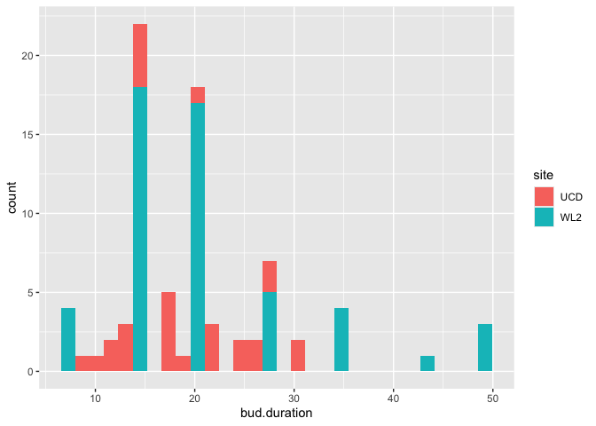
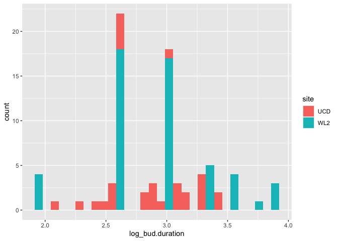
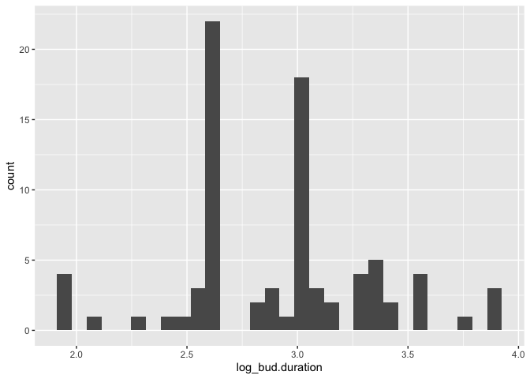
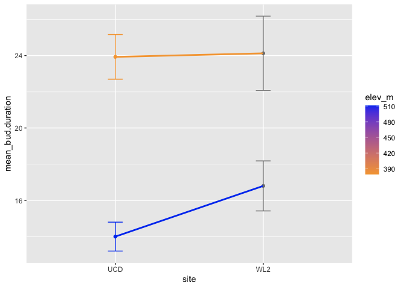

``` r
library(dplyr)
```

```
## 
## Attaching package: 'dplyr'
```

```
## The following objects are masked from 'package:stats':
## 
##     filter, lag
```

```
## The following objects are masked from 'package:base':
## 
##     intersect, setdiff, setequal, union
```

``` r
library(tidyverse)
```

```
## ── Attaching core tidyverse packages ──────────────────────── tidyverse 2.0.0 ──
## ✔ forcats   1.0.0     ✔ readr     2.1.5
## ✔ ggplot2   3.5.1     ✔ stringr   1.5.1
## ✔ lubridate 1.9.3     ✔ tibble    3.2.1
## ✔ purrr     1.0.2     ✔ tidyr     1.3.1
```

```
## ── Conflicts ────────────────────────────────────────── tidyverse_conflicts() ──
## ✖ dplyr::filter() masks stats::filter()
## ✖ dplyr::lag()    masks stats::lag()
## ℹ Use the conflicted package (<http://conflicted.r-lib.org/>) to force all conflicts to become errors
```

``` r
library(lubridate)
library(lme4)
```

```
## Loading required package: Matrix
## 
## Attaching package: 'Matrix'
## 
## The following objects are masked from 'package:tidyr':
## 
##     expand, pack, unpack
```

``` r
library(bbmle)
```

```
## Loading required package: stats4
## 
## Attaching package: 'bbmle'
## 
## The following object is masked from 'package:dplyr':
## 
##     slice
```

``` r
library(googlesheets4)
library(lmtest)
```

```
## Loading required package: zoo
## 
## Attaching package: 'zoo'
## 
## The following objects are masked from 'package:base':
## 
##     as.Date, as.Date.numeric
```

``` r
library(car)
```

```
## Loading required package: carData
## 
## Attaching package: 'car'
## 
## The following object is masked from 'package:purrr':
## 
##     some
## 
## The following object is masked from 'package:dplyr':
## 
##     recode
```

``` r
library(lmerTest)
```

```
## 
## Attaching package: 'lmerTest'
## 
## The following object is masked from 'package:lme4':
## 
##     lmer
## 
## The following object is masked from 'package:stats':
## 
##     step
```

``` r
sem <- function(x, na.rm=FALSE) {           #for caclulating standard error
  sd(x,na.rm=na.rm)/sqrt(length(na.omit(x)))
} 
```


``` r
init.repro <- read_csv("../input/init.repro.csv")
```

```
## New names:
## Rows: 179 Columns: 31
## ── Column specification
## ──────────────────────────────────────────────────────── Delimiter: "," chr
## (5): block, bed, col, pop, site dbl (26): ...1, row, mf, rep, bud.date_dt,
## flower.date_dt, fruit.date_dt, la...
## ℹ Use `spec()` to retrieve the full column specification for this data. ℹ
## Specify the column types or set `show_col_types = FALSE` to quiet this message.
## • `` -> `...1`
```

``` r
parent_pheno <- read_csv("../input/parent_pheno.csv")
```

```
## New names:
## Rows: 2491 Columns: 31
## ── Column specification
## ──────────────────────────────────────────────────────── Delimiter: "," chr
## (5): block, bed, col, pop, site dbl (25): ...1, row, mf, rep, bud.date_dt,
## flower.date_dt, fruit.date_dt, la... lgl (1): WL2_Y2_Prob_Fruits
## ℹ Use `spec()` to retrieve the full column specification for this data. ℹ
## Specify the column types or set `show_col_types = FALSE` to quiet this message.
## • `` -> `...1`
```

## Check Distribution 

``` r
init.repro %>% filter(!is.na(bud.duration)) %>% group_by(pop, site) %>% summarise(n=n()) 
```

```
## `summarise()` has grouped output by 'pop'. You can override using the `.groups`
## argument.
```

```
## # A tibble: 16 × 3
## # Groups:   pop [12]
##    pop   site      n
##    <chr> <chr> <int>
##  1 BH    UCD      15
##  2 BH    WL2      20
##  3 CC    WL2      10
##  4 CP2   UCD       1
##  5 DPR   UCD       2
##  6 IH    WL2      18
##  7 SC    UCD       1
##  8 SC    WL2      11
##  9 SQ1   WL2       1
## 10 SQ3   UCD       1
## 11 TM2   UCD      14
## 12 TM2   WL2      32
## 13 WL2   UCD       1
## 14 WL2   WL2       4
## 15 WR    WL2       1
## 16 YO7   WL2      16
```

``` r
#ONLY INCLUDING POPS THAT BUDDED AT BOTH GARDENS IN THE MODEL
both_bud_duration <- init.repro %>%
  filter(pop %in% c("BH", "TM2")) #SC and WL2 only have 1 indiv at UCD 

both_bud_duration %>% 
  ggplot(aes(bud.duration, fill=site))+
  geom_histogram() #skewed
```

```
## `stat_bin()` using `bins = 30`. Pick better value with `binwidth`.
```

```
## Warning: Removed 11 rows containing non-finite outside the scale range
## (`stat_bin()`).
```

<!-- -->

``` r
both_bud_duration%>%
  mutate(log_bud.duration = log(bud.duration)) %>%
  ggplot(aes(log_bud.duration, fill=site)) +
  geom_histogram()
```

```
## `stat_bin()` using `bins = 30`. Pick better value with `binwidth`.
```

```
## Warning: Removed 11 rows containing non-finite outside the scale range
## (`stat_bin()`).
```

<!-- -->

``` r
both_bud_duration%>%
  mutate(log_bud.duration = log(bud.duration)) %>%
  ggplot(aes(log_bud.duration)) +
  geom_histogram()
```

```
## `stat_bin()` using `bins = 30`. Pick better value with `binwidth`.
```

```
## Warning: Removed 11 rows containing non-finite outside the scale range
## (`stat_bin()`).
```

<!-- -->

## Bud duration Reaction norm

``` r
bud.duration_summary <- both_bud_duration %>%
group_by(pop, site, elev_m) %>%
summarize(N_bud = sum(!is.na(bud.duration)),
          mean_bud.duration = mean(bud.duration, na.rm=(TRUE)),
          sem_bud.duration = sem(bud.duration, na.rm=(TRUE))
          )
```

```
## `summarise()` has grouped output by 'pop', 'site'. You can override using the
## `.groups` argument.
```

``` r
bud.duration_summary %>%
  filter(N_bud != 1) %>%
  ggplot(aes(x=site, y=mean_bud.duration, group=pop, color=elev_m)) +
  geom_point(size=1.5) +
  geom_line(size=1) +
  geom_errorbar(aes(ymin=mean_bud.duration-sem_bud.duration, ymax=mean_bud.duration+sem_bud.duration), width=0.1) +
  scale_colour_gradient(low = "#F5A540", high = "#0043F0")
```

```
## Warning: Using `size` aesthetic for lines was deprecated in ggplot2 3.4.0.
## ℹ Please use `linewidth` instead.
## This warning is displayed once every 8 hours.
## Call `lifecycle::last_lifecycle_warnings()` to see where this warning was
## generated.
```

<!-- -->


#### Model: Does reproductive duration differ by site/elevation?


``` r
#does budding duration differ by garden?
bud_dur_int <- lmer(bud.duration ~ site*elev_m + (1|pop),
                    data=init.repro)
summary(bud_dur_int)
Anova(bud_dur_int)

bud_duration_site<- lmer(bud.duration ~ site + (1|pop),
                     data=init.repro)
summary(bud_duration_site)
Anova(bud_duration_site)

bud_duration_elev<- lmer(bud.duration ~ elev_m + (1|pop),
                     data=init.repro)
summary(bud_duration_elev)
Anova(bud_duration_elev)

ICtab(bud_dur_int, bud_duration_site, bud_duration_elev) #site fixed with random  pop is the best fit


#Do we want to include year as a random effect because we have 2 years at WL2
#Do we still see the same pattern removing WL2 2023 individuals?
#test <- init.repro %>%
  #filter(!(site == "WL2" & year == 23)) #want to see if having multiple WL2 years impacts the model - NO IT DOES NOT SO I WILL LEAVE IT IN
#bud_test_no_23 <- lmer(bud.duration ~ site + (1|pop),
 #                    data=test)
#summary(bud_test_no_23)
#Anova(bud_test_no_23)


#does flowering duration differ by garden?
flw_dur <- init.repro %>%
  filter(!is.na(flower.duration)) #only include indiv that flowered
         
flw_dur_int <- lmer(flower.duration ~ site*elev_m + (1|pop),
                    data=flw_dur)
summary(flw_dur_int)
Anova(flw_dur_int)

flw_duration_site <- lmer(flower.duration ~ site + (1|pop),
                          data=flw_dur)
summary(flw_duration_site)
Anova(flw_duration_site)

ICtab(flw_dur_int, flw_duration_site) #just site as a fixed effect is the best fit

#does fruiting duration differ by garden? 
frt_duration_site <- lmer(fruit.duration ~ site + (1|pop),
                          data=init.repro)
Anova(frt_duration_site)

#does total reproductive duration differ by garden?
repro_duration_interaction <- lmer(total.repro.duration ~ site*elev_m + (1|pop) + (site|block),
                       data=init.repro)
summary(repro_duration_interaction)
Anova(repro_duration_interaction)

repro_duration_add <- lmer(total.repro.duration ~ site + elev_m + (1|pop) + (site|block),
                       data=init.repro)
summary(repro_duration_add)

Anova(repro_duration_add)

ICtab(repro_duration_interaction, repro_duration_add)
```

#### Calculating means and sem


``` r
sem <- function(x, na.rm=FALSE) {           #for calculating standard error
  sd(x,na.rm=na.rm)/sqrt(length(na.omit(x)))
} 
repro_summary <- init.repro %>%
  group_by(pop, site, elev_m) %>%
  summarize(N_repro = sum(!is.na(total.repro.duration)),
            N_bud = sum(!is.na(bud.duration)),
            mean_total_dur = mean(total.repro.duration, na.rm=(TRUE)),
            sem_total_dur = sem(total.repro.duration, na.rm=(TRUE)),
            mean_bud_dur = mean(bud.duration, na.rm=(TRUE)),
            sem_bud_dur = sem(bud.duration, na.rm=(TRUE)),
            mean_flw_dur = mean(flower.duration, na.rm=(TRUE)),
            sem_flw_dur = sem(flower.duration, na.rm=(TRUE))
            )
```

```
## `summarise()` has grouped output by 'pop', 'site'. You can override using the
## `.groups` argument.
```

#### Does budding duration differ by elevation/latitude/pops at WL2? - can I use climate distance here since it is only 1 garden


``` r
init.repro %>%
  filter(site == "WL2") %>%
  ggplot(aes(x=bud.duration, fill=year)) +
  geom_boxplot() +
  facet_wrap(~pop)

WL2_24_bud_dur <- init.repro %>%
  filter(site == "WL2") %>%
  filter(year == 24) %>%
  filter(!(is.na(bud.duration))) %>%
  filter(pop %in% c("BH", "CC", "IH", "SC", "TM2", "WL2", "YO7"))

both_clim_dist_WL2_24 <- both_clim_dist_WL2_24 %>%
  filter(TimePd == "Recent") 

WL2_24_bud_dur <- WL2_24_bud_dur %>%
  left_join(both_clim_dist_WL2_24 %>% select(pop, GrwSsn_GD, Wtr_Year_GD), by="pop")

ggplot(WL2_24_bud_dur, aes(x = pop, y = bud.duration, fill = elev_m)) +
  geom_boxplot() +
  scale_fill_gradient(low = "#F5A540", high = "#0043F0")

WL2_bud_dur_elev <- lmer(bud.duration ~ elev_m + (1|pop),
                    data = WL2_24_bud_dur)
summary(WL2_bud_dur_elev)
Anova(WL2_bud_dur_elev) #Elevation is significant but latitude is not - seems like WL2 and YO7 are driving the significance bc they are higher elev pops with shorter durations

WL2_bud_dur_lat <- lmer(bud.duration ~ Lat + (1|pop),
                        data=WL2_24_bud_dur)
summary(WL2_bud_dur_lat)
Anova(WL2_bud_dur_lat)

ggplot(WL2_24_bud_dur, aes(x = pop, y = bud.duration, fill = GrwSsn_GD)) +
  geom_boxplot() +
  scale_fill_gradient(low = "#F5A540", high = "#0043F0")

WL2_bud_dur_clim <- lmer(bud.duration ~ GrwSsn_GD + (1|pop),
                         data=WL2_24_bud_dur)
summary(WL2_bud_dur_clim)
Anova(WL2_bud_dur_clim) #Clim dist is significant, TM2 might be driving this because it is farther and longer duration

ggplot(WL2_24_bud_dur, aes(x = pop, y = bud.duration, fill = Wtr_Year_GD)) +
  geom_boxplot() +
  scale_fill_gradient(low = "#F5A540", high = "#0043F0")

WL2_bud_dur_wtr <- lmer(bud.duration ~ Wtr_Year_GD + (1|pop),
                         data=WL2_24_bud_dur)
summary(WL2_bud_dur_wtr)
Anova(WL2_bud_dur_wtr) #Water year is significant, less similar has longer bud duration
```
