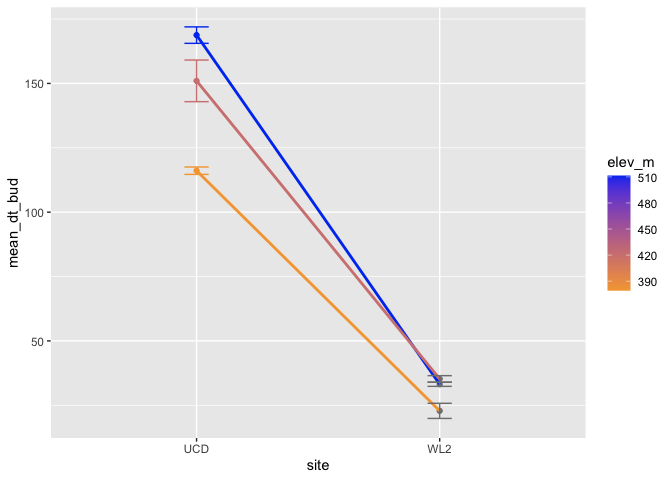
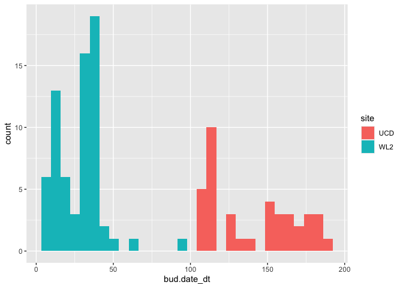
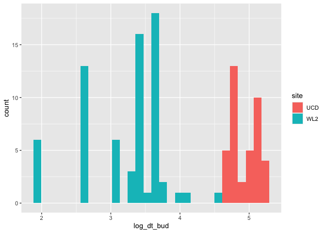
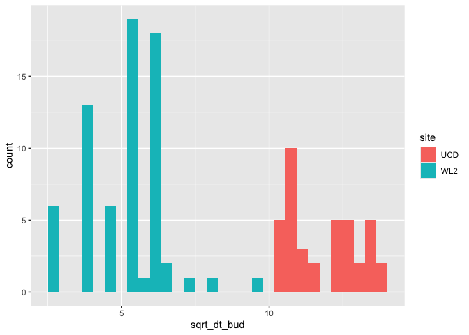
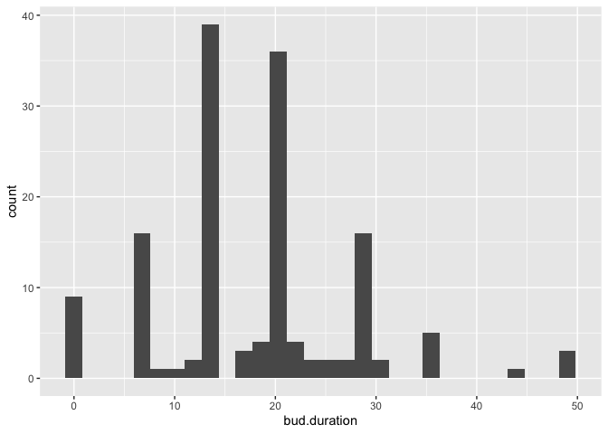
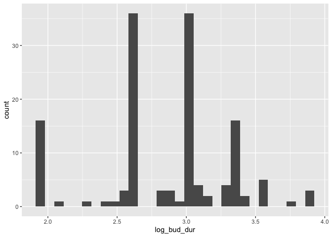
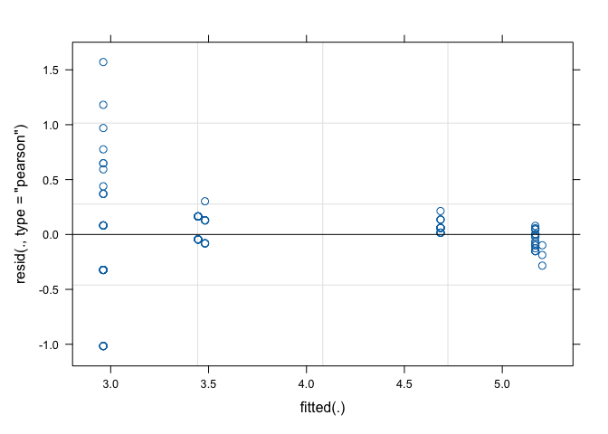
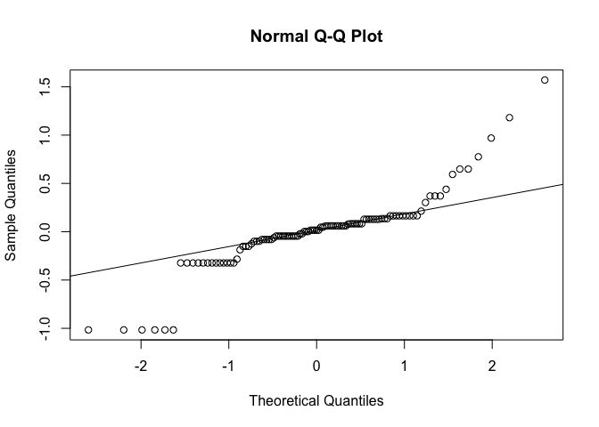
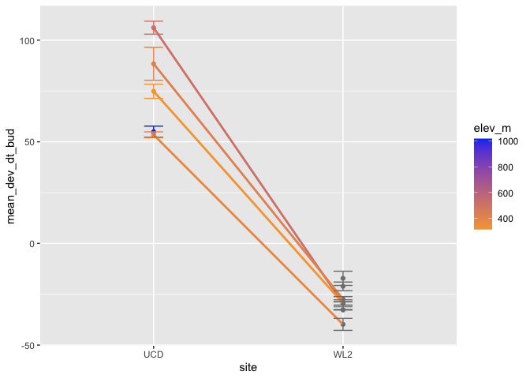

``` r
library(dplyr)
```

```
## 
## Attaching package: 'dplyr'
```

```
## The following objects are masked from 'package:stats':
## 
##     filter, lag
```

```
## The following objects are masked from 'package:base':
## 
##     intersect, setdiff, setequal, union
```

``` r
library(tidyverse)
```

```
## ── Attaching core tidyverse packages ──────────────────────── tidyverse 2.0.0 ──
## ✔ forcats   1.0.0     ✔ readr     2.1.5
## ✔ ggplot2   3.5.1     ✔ stringr   1.5.1
## ✔ lubridate 1.9.3     ✔ tibble    3.2.1
## ✔ purrr     1.0.2     ✔ tidyr     1.3.1
```

```
## ── Conflicts ────────────────────────────────────────── tidyverse_conflicts() ──
## ✖ dplyr::filter() masks stats::filter()
## ✖ dplyr::lag()    masks stats::lag()
## ℹ Use the conflicted package (<http://conflicted.r-lib.org/>) to force all conflicts to become errors
```

``` r
library(lubridate)
library(lme4)
```

```
## Loading required package: Matrix
## 
## Attaching package: 'Matrix'
## 
## The following objects are masked from 'package:tidyr':
## 
##     expand, pack, unpack
```

``` r
library(bbmle)
```

```
## Loading required package: stats4
## 
## Attaching package: 'bbmle'
## 
## The following object is masked from 'package:dplyr':
## 
##     slice
```

``` r
library(googlesheets4)
library(lmtest)
```

```
## Loading required package: zoo
## 
## Attaching package: 'zoo'
## 
## The following objects are masked from 'package:base':
## 
##     as.Date, as.Date.numeric
```

``` r
library(car)
```

```
## Loading required package: carData
## 
## Attaching package: 'car'
## 
## The following object is masked from 'package:purrr':
## 
##     some
## 
## The following object is masked from 'package:dplyr':
## 
##     recode
```

``` r
library(lmerTest)
```

```
## 
## Attaching package: 'lmerTest'
## 
## The following object is masked from 'package:lme4':
## 
##     lmer
## 
## The following object is masked from 'package:stats':
## 
##     step
```

``` r
sem <- function(x, na.rm=FALSE) {           #for caclulating standard error
  sd(x,na.rm=na.rm)/sqrt(length(na.omit(x)))
} 
```


``` r
init.repro <- read_csv("../input/init.repro.csv")
```

```
## New names:
## Rows: 179 Columns: 31
## ── Column specification
## ──────────────────────────────────────────────────────── Delimiter: "," chr
## (5): block, bed, col, pop, site dbl (26): ...1, row, mf, rep, bud.date_dt,
## flower.date_dt, fruit.date_dt, la...
## ℹ Use `spec()` to retrieve the full column specification for this data. ℹ
## Specify the column types or set `show_col_types = FALSE` to quiet this message.
## • `` -> `...1`
```

``` r
parent_pheno <- read_csv("../input/parent_pheno.csv")
```

```
## New names:
## Rows: 2491 Columns: 31
## ── Column specification
## ──────────────────────────────────────────────────────── Delimiter: "," chr
## (5): block, bed, col, pop, site dbl (25): ...1, row, mf, rep, bud.date_dt,
## flower.date_dt, fruit.date_dt, la... lgl (1): WL2_Y2_Prob_Fruits
## ℹ Use `spec()` to retrieve the full column specification for this data. ℹ
## Specify the column types or set `show_col_types = FALSE` to quiet this message.
## • `` -> `...1`
```

## Only pops that budded at both gardens

``` r
init.repro %>% filter(!is.na(bud.date_dt)) %>% group_by(pop, site) %>% summarise(n=n()) 
```

```
## `summarise()` has grouped output by 'pop'. You can override using the `.groups`
## argument.
```

```
## # A tibble: 19 × 3
## # Groups:   pop [13]
##    pop   site      n
##    <chr> <chr> <int>
##  1 BH    UCD      17
##  2 BH    WL2      20
##  3 CC    UCD       2
##  4 CC    WL2      13
##  5 CP2   UCD       1
##  6 DPR   UCD       5
##  7 FR    UCD       1
##  8 FR    WL2       2
##  9 IH    WL2      20
## 10 SC    UCD       3
## 11 SC    WL2      12
## 12 SQ1   WL2       1
## 13 SQ3   UCD       1
## 14 TM2   UCD      19
## 15 TM2   WL2      36
## 16 WL2   UCD       1
## 17 WL2   WL2       4
## 18 WR    WL2       1
## 19 YO7   WL2      16
```

``` r
#ONLY INCLUDING POPS THAT BUDDED AT BOTH GARDENS IN THE MODEL
both_bud <- init.repro %>%
  filter(pop %in% c("BH", "TM2", "SC")) #CC only has 2 indivs at UCD, FR has less than 3 at both sites, WL2 only has 1 indiv at UCD
```

#### Model: Does days to budding differ by site/elevation?


``` r
dt_bud <- lmer(bud.date_dt ~ site*elev_m + (1|pop),
               data=init.repro)
summary(dt_bud)
Anova(dt_bud) #THIS MAY BE PICKING UP THE POPS THAT ONLY BUDDED AT 1 OF THE GARDENS

dt_flw <- lmer(flower.date_dt ~ site*elev_m + (1|pop),
               data=init.repro)
summary(dt_flw)
Anova(dt_flw)

dt_bud_both <- lmer(bud.date_dt ~ site*elev_m + (1|pop),
               data=both_bud)
summary(dt_bud_both)
Anova(dt_bud_both) #BH is the highest of the low elevation pops and has a slighlty steeper slope than the others which is probably what is driving this site*elevation interaction, elevation is now a significant predictor because BH is at a higher elevation than the others but that is because the high elevation pops are no longer considered

dt_bud_both_site <- lmer(bud.date_dt ~ site + (1|pop),
                         data=both_bud)
summary(dt_bud_both_site)
Anova(dt_bud_both_site)
```

#### Dt bud reaction norms


``` r
dt_bud_summary <- both_bud %>%
  group_by(pop, site, elev_m) %>%
  summarize(N_bud = sum(!is.na(bud.date_dt)),
            mean_dt_bud = mean(bud.date_dt, na.rm=(TRUE)),
            sem_dt_bud = sem(bud.date_dt, na.rm=(TRUE))
            )
```

```
## `summarise()` has grouped output by 'pop', 'site'. You can override using the
## `.groups` argument.
```

``` r
dt_bud_summary %>%
  filter(N_bud != 1) %>%
  ggplot(aes(x=site, y=mean_dt_bud, group=pop, color=elev_m)) +
  geom_point(size=1.5) +
  geom_line(size=1) +
  geom_errorbar(aes(ymin=mean_dt_bud-sem_dt_bud, ymax=mean_dt_bud+sem_dt_bud), width=0.1) +
  scale_colour_gradient(low = "#F5A540", high = "#0043F0")
```

```
## Warning: Using `size` aesthetic for lines was deprecated in ggplot2 3.4.0.
## ℹ Please use `linewidth` instead.
## This warning is displayed once every 8 hours.
## Call `lifecycle::last_lifecycle_warnings()` to see where this warning was
## generated.
```

<!-- -->

#### Scaling

##### Check distributions - I'm not sure if log-transforming helped a whole log


``` r
both_bud %>%
  ggplot(aes(bud.date_dt, fill=site))+
  geom_histogram() #skewed similar to height
```

```
## `stat_bin()` using `bins = 30`. Pick better value with `binwidth`.
```

```
## Warning: Removed 2 rows containing non-finite outside the scale range
## (`stat_bin()`).
```

<!-- -->

``` r
both_bud%>%
  mutate(log_dt_bud = log(bud.date_dt)) %>%
  ggplot(aes(log_dt_bud, fill=site)) +
  geom_histogram() #still doesn't look exactly normally distributed but maybe better than before
```

```
## `stat_bin()` using `bins = 30`. Pick better value with `binwidth`.
```

```
## Warning: Removed 2 rows containing non-finite outside the scale range
## (`stat_bin()`).
```

<!-- -->

``` r
both_bud %>%
  mutate(sqrt_dt_bud = sqrt(bud.date_dt)) %>%
  ggplot(aes(sqrt_dt_bud, fill=site)) +
  geom_histogram()
```

```
## `stat_bin()` using `bins = 30`. Pick better value with `binwidth`.
```

```
## Warning: Removed 2 rows containing non-finite outside the scale range
## (`stat_bin()`).
```

<!-- -->

``` r
init.repro %>%
  ggplot(aes(bud.duration)) +
  geom_histogram() #not too bad, maybe a slight skew
```

```
## `stat_bin()` using `bins = 30`. Pick better value with `binwidth`.
```

```
## Warning: Removed 31 rows containing non-finite outside the scale range
## (`stat_bin()`).
```

<!-- -->

``` r
init.repro %>%
  mutate(log_bud_dur = log(bud.duration)) %>%
  ggplot(aes(log_bud_dur)) +
  geom_histogram() #idk if this made it any better
```

```
## `stat_bin()` using `bins = 30`. Pick better value with `binwidth`.
```

```
## Warning: Removed 40 rows containing non-finite outside the scale range
## (`stat_bin()`).
```

<!-- -->

``` r
scale_bud <- both_bud %>%
  mutate(log_dt_bud = log(bud.date_dt)) %>%
  mutate(sqrt_dt_bud =sqrt(bud.date_dt))


scale_log_dt_bud <- lmer(log_dt_bud ~ site + (1|pop),
                     data=scale_bud)

summary(scale_log_dt_bud)
```

```
## Linear mixed model fit by REML. t-tests use Satterthwaite's method [
## lmerModLmerTest]
## Formula: log_dt_bud ~ site + (1 | pop)
##    Data: scale_bud
## 
## REML criterion at convergence: 113.9
## 
## Scaled residuals: 
##     Min      1Q  Median      3Q     Max 
## -2.6057 -0.2540  0.0406  0.3310  4.0261 
## 
## Random effects:
##  Groups   Name        Variance Std.Dev.
##  pop      (Intercept) 0.08963  0.2994  
##  Residual             0.15213  0.3900  
## Number of obs: 107, groups:  pop, 3
## 
## Fixed effects:
##              Estimate Std. Error        df t value Pr(>|t|)    
## (Intercept)   5.01921    0.18575   2.41103   27.02 0.000473 ***
## siteWL2      -1.72243    0.07949 103.46507  -21.67  < 2e-16 ***
## ---
## Signif. codes:  0 '***' 0.001 '**' 0.01 '*' 0.05 '.' 0.1 ' ' 1
## 
## Correlation of Fixed Effects:
##         (Intr)
## siteWL2 -0.283
```

``` r
Anova(scale_log_dt_bud)
```

```
## Analysis of Deviance Table (Type II Wald chisquare tests)
## 
## Response: log_dt_bud
##       Chisq Df Pr(>Chisq)    
## site 469.56  1  < 2.2e-16 ***
## ---
## Signif. codes:  0 '***' 0.001 '**' 0.01 '*' 0.05 '.' 0.1 ' ' 1
```

``` r
plot(scale_log_dt_bud, which = 1)
```

<!-- -->

``` r
qqnorm(resid(scale_log_dt_bud))
qqline(resid(scale_log_dt_bud)) #fit diagnostics not great 
```

<!-- -->

``` r
#GAMMA distribution with log link - BAD!

#scale_log_dt_bud_gamma <- glmer(bud.date_dt ~ site + #(1|pop),
#                                family=Gamma(link="log"#),
       #                         data=init.repro)
#summary(scale_log_dt_bud_gamma)
#Anova(scale_log_dt_bud_gamma)

#predicted <- predict(scale_log_dt_bud_gamma, type = "response")
#plot(dt.bud.scaled$bud.date_dt, predicted,
 #    xlab = "Observed", ylab = "Predicted",
  #   main = "Observed vs. Predicted (Gamma GLMM)")
#abline(0, 1, col = "red")


#WEIBULL DISTRIBUTION???
```

##### Deviation from grand mean = dt bud - grand mean


``` r
dt.bud.scaled <- init.repro %>%
  filter(!(is.na(bud.date_dt))) %>%
  mutate(Grand_mean_dt_bud = mean(bud.date_dt)) %>%
  mutate(Dev_grand_mean_dt_bud = (bud.date_dt - Grand_mean_dt_bud))

both_bud_scaled <- dt.bud.scaled %>%
  filter(pop %in% c("BH", "TM2", "CC", "SC"))

dt_bud_both_site_scaled <- lmer(Dev_grand_mean_dt_bud ~ site + (1|pop),
                         data=both_bud_scaled)
summary(dt_bud_both_site_scaled)
```

```
## Linear mixed model fit by REML. t-tests use Satterthwaite's method [
## lmerModLmerTest]
## Formula: Dev_grand_mean_dt_bud ~ site + (1 | pop)
##    Data: both_bud_scaled
## 
## REML criterion at convergence: 1002.2
## 
## Scaled residuals: 
##     Min      1Q  Median      3Q     Max 
## -1.2459 -0.6841 -0.2082  0.2678  5.1635 
## 
## Random effects:
##  Groups   Name        Variance Std.Dev.
##  pop      (Intercept) 134.9    11.61   
##  Residual             216.3    14.71   
## Number of obs: 122, groups:  pop, 4
## 
## Fixed effects:
##             Estimate Std. Error       df t value Pr(>|t|)    
## (Intercept)   80.850      6.350    3.960   12.73 0.000233 ***
## siteWL2     -111.261      2.892  117.951  -38.47  < 2e-16 ***
## ---
## Signif. codes:  0 '***' 0.001 '**' 0.01 '*' 0.05 '.' 0.1 ' ' 1
## 
## Correlation of Fixed Effects:
##         (Intr)
## siteWL2 -0.324
```

``` r
Anova(dt_bud_both_site_scaled)
```

```
## Analysis of Deviance Table (Type II Wald chisquare tests)
## 
## Response: Dev_grand_mean_dt_bud
##       Chisq Df Pr(>Chisq)    
## site 1479.8  1  < 2.2e-16 ***
## ---
## Signif. codes:  0 '***' 0.001 '**' 0.01 '*' 0.05 '.' 0.1 ' ' 1
```

``` r
sem <- function(x, na.rm=FALSE) {           #for calculating standard error
  sd(x,na.rm=na.rm)/sqrt(length(na.omit(x)))
} 

dt_bud_summary_scaled <- dt.bud.scaled %>%
  group_by(pop, site, elev_m) %>%
  summarize(N_bud = sum(!is.na(Dev_grand_mean_dt_bud)),
            mean_dev_dt_bud = mean(Dev_grand_mean_dt_bud, na.rm=(TRUE)),
            sem_dev_dt_bud = sem(Dev_grand_mean_dt_bud, na.rm=(TRUE))
            )
```

```
## `summarise()` has grouped output by 'pop', 'site'. You can override using the
## `.groups` argument.
```

``` r
dt_bud_summary_scaled %>%
  filter(N_bud != 1) %>%
  ggplot(aes(x=site, y=mean_dev_dt_bud, group=pop, color=elev_m)) +
  geom_point(size=1.5) +
  geom_line(size=1) +
  geom_errorbar(aes(ymin=mean_dev_dt_bud-sem_dev_dt_bud, ymax=mean_dev_dt_bud+sem_dev_dt_bud), width=0.1) +
  scale_colour_gradient(low = "#F5A540", high = "#0043F0")
```

<!-- -->

#### Dt bud at WL2 and climate distance


``` r
WL2_24_dt_bud <- init.repro %>%
  filter(site == "WL2") %>%
  filter(year == 24) %>%
  filter(!(is.na(bud.date_dt))) %>%
  filter(!(pop %in% c("SQ1", "WR"))) %>%
  left_join(both_clim_dist_WL2_24 %>% select(pop, GrwSsn_GD, Wtr_Year_GD), by="pop")

ggplot(WL2_24_dt_bud, aes(x=pop, y=bud.date_dt, fill=elev_m)) +
  geom_boxplot() +
  scale_fill_gradient(low = "#F5A540", high = "#0043F0")

ggplot(WL2_24_dt_bud, aes(x=pop, y=bud.date_dt, fill=GrwSsn_GD)) +
  geom_boxplot() +
  scale_fill_gradient(low = "#F5A540", high = "#0043F0")

WL2_dt_bud_GrwSsn <- lmer(bud.date_dt ~ GrwSsn_GD + (1|pop),
                          data=WL2_24_dt_bud)
summary(WL2_dt_bud_GrwSsn)
Anova(WL2_dt_bud_GrwSsn)

ggplot(WL2_24_dt_bud, aes(x=pop, y=bud.date_dt, fill=Wtr_Year_GD)) +
  geom_boxplot() +
  scale_fill_gradient(low = "#F5A540", high = "#0043F0")

WL2_dt_bud_WtrYr <- lmer(bud.date_dt ~ Wtr_Year_GD + (1|pop),
                          data=WL2_24_dt_bud)
summary(WL2_dt_bud_WtrYr)
Anova(WL2_dt_bud_WtrYr)
```

#### Dt bud at UCD and climate distance


``` r
clim_dist_UCD22_23 <- clim_dist_UCD22_23 %>%
  rename(pop=parent.pop) %>%
  rename(GrwSsn_GD=Gowers_Dist)%>%
  filter(TimePd == "Recent")

wtr_year_UCD <- wtr_year_UCD %>%
  rename(pop=parent.pop) %>%
  rename(Wtr_Year_GD=Gowers_Dist)%>%
  filter(TimePd == "Recent")

UCD_dt_bud <- init.repro %>%
  filter(site == "UCD") %>%
  filter(!(is.na(bud.date_dt))) %>%
  filter(pop %in% c("TM2", "BH", "CC", "DPR", "SC")) %>%
  left_join(clim_dist_UCD22_23 %>% select(pop, GrwSsn_GD), by="pop") %>%
  left_join(wtr_year_UCD %>% select(pop, Wtr_Year_GD), by="pop")

ggplot(UCD_dt_bud, aes(x=pop, y=bud.date_dt, fill=GrwSsn_GD)) +
  geom_boxplot() +
  scale_fill_gradient(low = "#F5A540", high = "#0043F0")

UCD_dt_bud_GrwSsn <- lmer(bud.date_dt ~ GrwSsn_GD + (1|pop),
                          data=UCD_dt_bud)
summary(UCD_dt_bud_GrwSsn)
Anova(UCD_dt_bud_GrwSsn)

ggplot(UCD_dt_bud, aes(x=pop, y=bud.date_dt, fill=Wtr_Year_GD)) +
  geom_boxplot() +
  scale_fill_gradient(low = "#F5A540", high = "#0043F0")

UCD_dt_bud_WtrYr <- lmer(bud.date_dt ~ Wtr_Year_GD + (1|pop),
                          data=UCD_dt_bud)
summary(UCD_dt_bud_WtrYr)
Anova(UCD_dt_bud_WtrYr)
```
