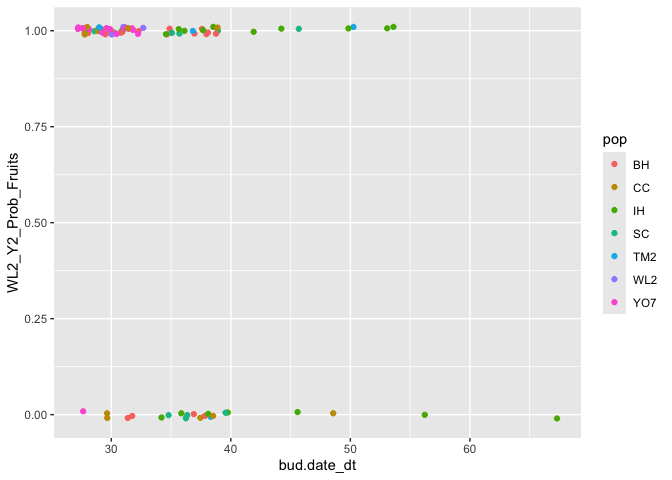
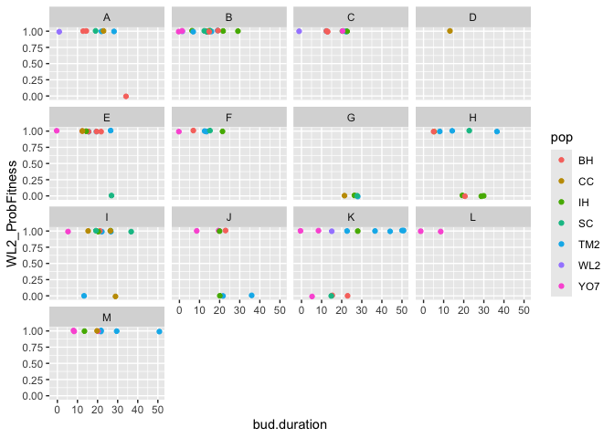
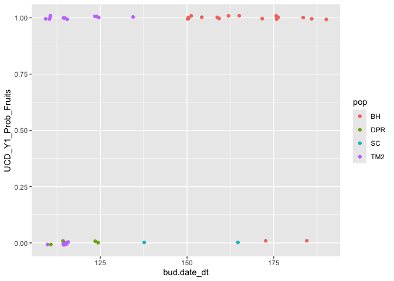
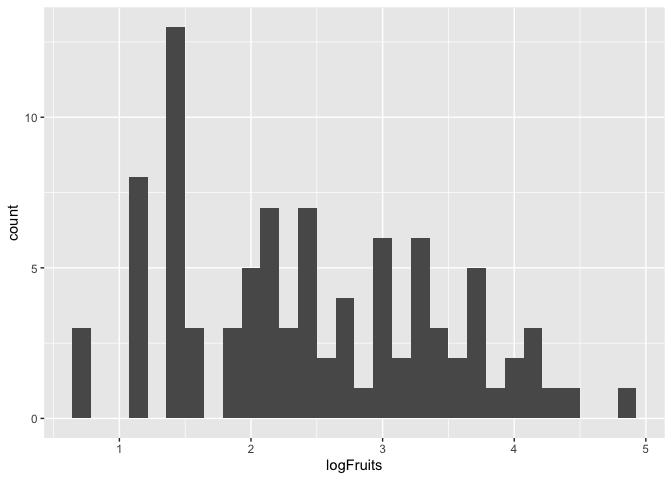

``` r
library(dplyr)
```

```
## 
## Attaching package: 'dplyr'
```

```
## The following objects are masked from 'package:stats':
## 
##     filter, lag
```

```
## The following objects are masked from 'package:base':
## 
##     intersect, setdiff, setequal, union
```

``` r
library(tidyverse)
```

```
## ── Attaching core tidyverse packages ──────────────────────── tidyverse 2.0.0 ──
## ✔ forcats   1.0.0     ✔ readr     2.1.5
## ✔ ggplot2   3.5.1     ✔ stringr   1.5.1
## ✔ lubridate 1.9.3     ✔ tibble    3.2.1
## ✔ purrr     1.0.2     ✔ tidyr     1.3.1
```

```
## ── Conflicts ────────────────────────────────────────── tidyverse_conflicts() ──
## ✖ dplyr::filter() masks stats::filter()
## ✖ dplyr::lag()    masks stats::lag()
## ℹ Use the conflicted package (<http://conflicted.r-lib.org/>) to force all conflicts to become errors
```

``` r
library(lubridate)
library(lme4)
```

```
## Loading required package: Matrix
## 
## Attaching package: 'Matrix'
## 
## The following objects are masked from 'package:tidyr':
## 
##     expand, pack, unpack
```

``` r
library(bbmle)
```

```
## Loading required package: stats4
## 
## Attaching package: 'bbmle'
## 
## The following object is masked from 'package:dplyr':
## 
##     slice
```

``` r
library(googlesheets4)
library(lmtest)
```

```
## Loading required package: zoo
## 
## Attaching package: 'zoo'
## 
## The following objects are masked from 'package:base':
## 
##     as.Date, as.Date.numeric
```

``` r
library(car)
```

```
## Loading required package: carData
## 
## Attaching package: 'car'
## 
## The following object is masked from 'package:purrr':
## 
##     some
## 
## The following object is masked from 'package:dplyr':
## 
##     recode
```

``` r
library(lmerTest)
```

```
## 
## Attaching package: 'lmerTest'
## 
## The following object is masked from 'package:lme4':
## 
##     lmer
## 
## The following object is masked from 'package:stats':
## 
##     step
```

``` r
sem <- function(x, na.rm=FALSE) {           #for caclulating standard error
  sd(x,na.rm=na.rm)/sqrt(length(na.omit(x)))
} 
```


``` r
#Input Cleaned Common Garden Data
UCD22_23 <- read_csv("../input/UCD22_23_transplant.csv")
```

```
## Rows: 858 Columns: 20
## ── Column specification ────────────────────────────────────────────────────────
## Delimiter: ","
## chr  (4): block, col, pop, Notes
## dbl  (9): row, mf, rep, bud.date_dt, flower.date_dt, fruit.date_dt, last.FR....
## date (7): bud.date, flower.date, fruit.date, last.FR.date, last.FL.date, dea...
## 
## ℹ Use `spec()` to retrieve the full column specification for this data.
## ℹ Specify the column types or set `show_col_types = FALSE` to quiet this message.
```

``` r
WL2_23 <- read_csv("../input/WL2_23.csv")
```

```
## Rows: 1826 Columns: 20
## ── Column specification ────────────────────────────────────────────────────────
## Delimiter: ","
## chr  (5): block, bed, col, pop, survey.notes
## dbl  (7): row, mf, rep, bud.date_dt, flower.date_dt, fruit.date_dt, death.da...
## lgl  (4): last.FL.date, last.FR.date, last.FL.date_dt, last.FR.date_dt
## date (4): bud.date, flower.date, fruit.date, death.date
## 
## ℹ Use `spec()` to retrieve the full column specification for this data.
## ℹ Specify the column types or set `show_col_types = FALSE` to quiet this message.
```

``` r
WL2_24 <- read_csv("../input/WL2_24.csv")
```

```
## Rows: 159 Columns: 23
## ── Column specification ────────────────────────────────────────────────────────
## Delimiter: ","
## chr   (5): bed, col, unique.ID, survey.notes, pop
## dbl  (10): row, mf, rep, bud.date_dt, flower.date_dt, fruit.date_dt, last.FL...
## lgl   (1): block
## date  (7): bud.date, flower.date, fruit.date, last.FL.date, last.FR.date, de...
## 
## ℹ Use `spec()` to retrieve the full column specification for this data.
## ℹ Specify the column types or set `show_col_types = FALSE` to quiet this message.
```

``` r
#Input Climate Distance Data
clim_dist_UCD22_23 <- read_csv("../input/growthseason_GowersEnvtalDist_UCD.csv")
```

```
## Rows: 46 Columns: 11
## ── Column specification ────────────────────────────────────────────────────────
## Delimiter: ","
## chr (3): parent.pop, elevation.group, TimePd
## dbl (8): elev_m, Lat, Long, Gowers_Dist, bias, std.error, conf.low, conf.high
## 
## ℹ Use `spec()` to retrieve the full column specification for this data.
## ℹ Specify the column types or set `show_col_types = FALSE` to quiet this message.
```

``` r
wtr_year_UCD <- read_csv("../input/full_year_GowersEnvtalDist_UCD_wtr_year.csv")
```

```
## Rows: 46 Columns: 11
## ── Column specification ────────────────────────────────────────────────────────
## Delimiter: ","
## chr (3): parent.pop, elevation.group, TimePd
## dbl (8): elev_m, Lat, Long, Gowers_Dist, bias, std.error, conf.low, conf.high
## 
## ℹ Use `spec()` to retrieve the full column specification for this data.
## ℹ Specify the column types or set `show_col_types = FALSE` to quiet this message.
```

``` r
clim_dist_WL2_23 <- read_csv("../input/growthseason_GowersEnvtalDist_WL2.csv")
```

```
## Rows: 46 Columns: 11
## ── Column specification ────────────────────────────────────────────────────────
## Delimiter: ","
## chr (3): parent.pop, elevation.group, TimePd
## dbl (8): elev_m, Lat, Long, Gowers_Dist, bias, std.error, conf.low, conf.high
## 
## ℹ Use `spec()` to retrieve the full column specification for this data.
## ℹ Specify the column types or set `show_col_types = FALSE` to quiet this message.
```

``` r
wtr_year_WL2_23 <- read_csv("../input/full_year_GowersEnvtalDist_WL2_wtr_year.csv")
```

```
## Rows: 46 Columns: 11
## ── Column specification ────────────────────────────────────────────────────────
## Delimiter: ","
## chr (3): parent.pop, elevation.group, TimePd
## dbl (8): elev_m, Lat, Long, Gowers_Dist, bias, std.error, conf.low, conf.high
## 
## ℹ Use `spec()` to retrieve the full column specification for this data.
## ℹ Specify the column types or set `show_col_types = FALSE` to quiet this message.
```

``` r
both_clim_dist_WL2_24 <- read_csv("../input/Gowers_WL2_2024.csv")
```

```
## Rows: 46 Columns: 8
## ── Column specification ────────────────────────────────────────────────────────
## Delimiter: ","
## chr (3): parent.pop, elevation.group, TimePd
## dbl (5): elev_m, Lat, Long, GrwSsn_GD, Wtr_Year_GD
## 
## ℹ Use `spec()` to retrieve the full column specification for this data.
## ℹ Specify the column types or set `show_col_types = FALSE` to quiet this message.
```

``` r
#Input Fitness Data
UCD_fruit <- read_csv("../input/UCD_Fruits.csv")
```

```
## Rows: 63 Columns: 23
## ── Column specification ────────────────────────────────────────────────────────
## Delimiter: ","
## chr  (5): block, col, Genotype, pop, elevation.group
## dbl (18): row, mf, rep, elev_m, Lat, Long, flowers, fruits, FrFlN, GrwSsn_GD...
## 
## ℹ Use `spec()` to retrieve the full column specification for this data.
## ℹ Specify the column types or set `show_col_types = FALSE` to quiet this message.
```

``` r
WL2_24_fruit <- read_csv("../input/WL2_Fruits_Y2.csv")
```

```
## Rows: 73 Columns: 26
## ── Column specification ────────────────────────────────────────────────────────
## Delimiter: ","
## chr  (8): Pop.Type, loc, bed, col, pop, Genotype, block, elevation.group
## dbl (18): row, mf, rep, flowers, fruits, FrFlN, elev_m, Lat, Long, GrwSsn_GD...
## 
## ℹ Use `spec()` to retrieve the full column specification for this data.
## ℹ Specify the column types or set `show_col_types = FALSE` to quiet this message.
```

``` r
WL2_23_fruit <- read_csv("../input/WL2_Fruits_Y1.csv")
```

```
## Rows: 25 Columns: 25
## ── Column specification ────────────────────────────────────────────────────────
## Delimiter: ","
## chr  (7): block, BedLoc, bed, bed-col, Genotype, pop, elevation.group
## dbl (18): bed-row, mf, rep, flowers, fruits, FrFlN, elev_m, Lat, Long, GrwSs...
## 
## ℹ Use `spec()` to retrieve the full column specification for this data.
## ℹ Specify the column types or set `show_col_types = FALSE` to quiet this message.
```

``` r
WL2_24_frt_prob <- read_csv("../input/WL2_ProbFruits_Y2.csv")
```

```
## Rows: 95 Columns: 23
## ── Column specification ────────────────────────────────────────────────────────
## Delimiter: ","
## chr  (7): loc, bed, col, block, pop, Genotype, elevation.group
## dbl (16): row, mf, rep, elev_m, Lat, Long, GrwSsn_GD_Recent, GrwSsn_GD_Histo...
## 
## ℹ Use `spec()` to retrieve the full column specification for this data.
## ℹ Specify the column types or set `show_col_types = FALSE` to quiet this message.
```

``` r
UCD_frt_prob <- read_csv("../input/ProbFruits_UCD.csv")
```

```
## Rows: 50 Columns: 23
## ── Column specification ────────────────────────────────────────────────────────
## Delimiter: ","
## chr  (5): block, col, Genotype, pop, elevation.group
## dbl (18): row, mf, rep, elev_m, Lat, Long, GrwSsn_GD_Recent, GrwSsn_GD_Histo...
## 
## ℹ Use `spec()` to retrieve the full column specification for this data.
## ℹ Specify the column types or set `show_col_types = FALSE` to quiet this message.
```

``` r
WL2_prob_fit <- read_csv("../input/WL2_ProbFitness.csv")
```

```
## Rows: 1573 Columns: 20
## ── Column specification ────────────────────────────────────────────────────────
## Delimiter: ","
## chr  (7): block, BedLoc, bed, bed.col, Genotype, pop, elevation.group
## dbl (13): bed.row, mf, rep, elev_m, Lat, Long, GrwSsn_GD_Recent, GrwSsn_GD_H...
## 
## ℹ Use `spec()` to retrieve the full column specification for this data.
## ℹ Specify the column types or set `show_col_types = FALSE` to quiet this message.
```

``` r
WL2_total_fit <- read_csv("../input/WL2_TotalRepOutput.csv")
```

```
## Rows: 98 Columns: 21
## ── Column specification ────────────────────────────────────────────────────────
## Delimiter: ","
## chr  (7): block, BedLoc, bed, bed.col, Genotype, pop, elevation.group
## dbl (14): bed.row, mf, rep, elev_m, Lat, Long, GrwSsn_GD_Recent, GrwSsn_GD_H...
## 
## ℹ Use `spec()` to retrieve the full column specification for this data.
## ℹ Specify the column types or set `show_col_types = FALSE` to quiet this message.
```

## Setting up data frame

### Select only the columns of interest and only parent pops from the WL2_24 garden


``` r
UCD22_23 <- UCD22_23 %>%
  mutate(bed = str_extract(block, "^[A-Za-z]")) %>% #create column for bed by extracting info from block column
  select(block, bed, row, col, everything()) %>% #reorder columns
  select(block, bed, row, col, pop, mf, rep, bud.date_dt, flower.date_dt, fruit.date_dt, last.FL.date_dt, last.FR.date_dt, death.date_dt) %>% #select columns of interest
  filter(pop != "buffer") #filter out buffer plants

WL2_23 <- WL2_23 %>%
  select(block, bed, row, col, pop, mf, rep, bud.date_dt, flower.date_dt, fruit.date_dt, last.FL.date_dt, last.FR.date_dt, death.date_dt) %>%
  filter(grepl("^\\d+$", rep)) #removes buffer plants and empty spaces

WL2_24 <- WL2_24 %>%
  select(bed, row, col, pop, mf, rep, bud.date_dt, flower.date_dt, fruit.date_dt, last.FL.date_dt, last.FR.date_dt, death.date_dt) %>%
  left_join(WL2_23 %>% select(block, bed, row, col), by=c("bed", "row", "col")) %>% #add block info using WL2_23 block column
  select(block, bed, row, col, everything()) #reorder columns 
```

### Combine all gardens into one tibble, add site and year columns


``` r
parent_pheno <- bind_rows(
  UCD22_23 %>% mutate(site="UCD_23"),
  WL2_23 %>% mutate(site="WL2_23"),
  WL2_24 %>% mutate(site="WL2_24")
)

parent_pheno <- parent_pheno %>%
  separate(site, into = c("site", "year"), sep = "_")
```

### Add elevation and latitude data
No longer need this chunk with climate distance input below 

``` r
both_clim_dist_WL2_24 <- both_clim_dist_WL2_24 %>%
  filter(TimePd == "Recent") %>%
  rename(pop=parent.pop)

parent_pheno <- parent_pheno %>%
  left_join(both_clim_dist_WL2_24 %>% select(pop, elev_m, Lat), by="pop")
```

### Add recent climate distance - could have also added climate distance from fitness data csv


``` r
clim_dist_UCD22_23 <- clim_dist_UCD22_23 %>%
  filter(TimePd == "Recent") %>%
  rename(pop=parent.pop) %>%
  rename(GrwSsn_GD=Gowers_Dist) %>%
  mutate(site="UCD")

wtr_year_UCD <- wtr_year_UCD %>%
  filter(TimePd == "Recent") %>%
  rename(pop=parent.pop) %>%
  rename(Wtr_Year_GD=Gowers_Dist) %>%
  mutate(site="UCD")

clim_dist_WL2_23 <- clim_dist_WL2_23 %>%
  filter(TimePd == "Recent") %>%
  rename(pop=parent.pop) %>% 
  rename(GrwSsn_GD=Gowers_Dist) %>%
  mutate(site = "WL2") %>%
  mutate(year= 23)

wtr_year_WL2_23 <- wtr_year_WL2_23 %>%
  filter(TimePd == "Recent") %>%
  rename(pop=parent.pop) %>%
  rename(Wtr_Year_GD=Gowers_Dist) %>%
  mutate(site = "WL2") %>%
  mutate(year=23)

both_clim_dist_WL2_24 <- both_clim_dist_WL2_24 %>%
  filter(TimePd == "Recent") %>%
  mutate(site = "WL2") %>%
  rename(pop=parent.pop) %>%
  mutate(year = 24)

parent_pheno_climdist <- parent_pheno %>%
  mutate(year = as.numeric(year)) %>%
  left_join(clim_dist_UCD22_23 %>% select(pop,elev_m, GrwSsn_GD, site), by = c("pop", "site")) %>%
  left_join(wtr_year_UCD %>% select(pop, Wtr_Year_GD, site), by = c("pop", "site")) %>%
  left_join(clim_dist_WL2_23 %>% select(pop, GrwSsn_GD, site, year), by = c("pop", "site", "year")) %>%
  left_join(wtr_year_WL2_23 %>% select(pop, Wtr_Year_GD, site, year), by = c("pop", "site", "year")) %>%
  left_join(both_clim_dist_WL2_24 %>% select(pop, site, year, GrwSsn_GD, Wtr_Year_GD), by = c("pop", "site", "year")) %>%
  mutate(
    Grw_Ssn_GD = coalesce(GrwSsn_GD.x, GrwSsn_GD.y, GrwSsn_GD),
    Wtr_Yr_GD = coalesce(Wtr_Year_GD.x, Wtr_Year_GD.y, Wtr_Year_GD)
  ) %>%
  select(-GrwSsn_GD.x, -GrwSsn_GD.y, -GrwSsn_GD, -Wtr_Year_GD.x, -Wtr_Year_GD.y, -Wtr_Year_GD)
```

### Add fitness data


``` r
#number of fruits made by each indiv at UCD
UCD_fruit <- UCD_fruit %>%
  mutate(site="UCD")

#prob making a fruit in year 1 at UCD given survival to bolting
UCD_frt_prob <- UCD_frt_prob %>%
  mutate(site = "UCD") %>%
  rename(UCD_Y1_Prob_Fruits=ProbFruits)

#number of fruits made at WL2 in 2023
WL2_23_fruit <- WL2_23_fruit %>%
  mutate(site="WL2") %>%
  mutate(year=23) %>%
  rename(row='bed-row') %>%
  rename(col='bed-col')

#number of fruits made at WL2 in 2024
WL2_24_fruit <- WL2_24_fruit %>%
  mutate(site="WL2") %>%
  mutate(year=24) 

#prob making a fruit in year 2 at WL2 (given the indiv survived to bolting)
WL2_24_frt_prob <- WL2_24_frt_prob %>%
  mutate(site="WL2") %>%
  mutate(year=24) %>%
  rename(WL2_Y2_Prob_Fruits=ProbFruits)

#prob of successfully reproducing - prob of making at least 1 fruit in year 1 or 2 at WL2
WL2_prob_fit <- WL2_prob_fit %>%
  rename(row=bed.row) %>%
  rename(col=bed.col) %>%
  rename(WL2_ProbFitness=ProbFitness) %>%
  mutate(site="WL2")
  
#Total repro output - total fruit number across both years at WL2
WL2_total_fit <- WL2_total_fit %>%
  rename(row=bed.row) %>%
  rename(col=bed.col) %>%
  rename(WL2_Total_Fitness=Total_Fitness) %>%
  rename(log_WL2_Total_Fitness=logTotalFitness) %>%
  mutate(site="WL2")

parent_pheno_fitness <- parent_pheno_climdist %>%
  left_join(UCD_fruit %>% select(block, row, col, site, fruits, FrFlN), by=c("block", "row", "col", "site")) %>%
  left_join(UCD_frt_prob %>% select(block, row, col, site, UCD_Y1_Prob_Fruits), by=c("block", "row", "col", "site")) %>%
  left_join(WL2_23_fruit %>% select(bed, row, col, site, year, fruits, FrFlN), by=c("bed", "row", "col", "year", "site")) %>%
  left_join(WL2_24_fruit %>% select(bed, row, col, site, year, fruits, FrFlN), by=c("bed", "row", "col", "year", "site")) %>%
  left_join(WL2_24_frt_prob %>% select(bed, row, col, site, year, WL2_Y2_Prob_Fruits), by=c("bed", "row", "col", "year", "site")) %>%
  left_join(WL2_prob_fit %>% select(bed, row, col, site, WL2_ProbFitness), by=c("bed", "row", "col", "site")) %>%
  left_join(WL2_total_fit %>% select(bed, row, col, site, WL2_Total_Fitness, log_WL2_Total_Fitness), by=c("bed", "row", "col", "site")) %>%
  mutate(
    Fruits = coalesce(fruits.x, fruits.y, fruits),
    FrFlw = coalesce(FrFlN.x, FrFlN.y, FrFlN)
  ) %>%
  select(-fruits.x, -fruits.y, -fruits, -FrFlN.x, -FrFlN.y, -FrFlN)
  #at UCD some rows have a 0 for ProbFruits but nothing for fruit and/or frflw and also the opposite - do I need to make sure if there is a 0 in ProbFruits that there is also a 0 in fruits
  #there are some cases where the plant has 0 fruits but the probability of making fruits is NA and not 0 because the plant might have still been alive by the last survey but not yet produced any fruits - what do I do here?
#this is because ProbFruits was the probabiliyt of making a fruit given survival to bolting so individuals that were still alive but didn't initiate reproduction by the last survey had a fruit count of 0 but were not included in the ProbFruits calc.
```

### Calculate duration of each reproductive stage and add binary column for initiating reproduction


``` r
#Bud duration (flower.date - bud.date)
#Flower duration (last.FL.date - flower.date)
#Fruit duration (last.FR.date - fruit.date)
#Total repro duration (last.FR.date - bud.date)
#Initiate repro(1 if there is any repro date, 0 if no repro date)
  # I would want to use bud.date to determine if a plant initiated repro, but we missed the bud date for some plants

parent_pheno_duration <- parent_pheno_fitness %>%
  mutate(bud.duration = as.numeric(flower.date_dt - bud.date_dt)) %>%
  mutate(flower.duration = as.numeric(last.FL.date_dt - flower.date_dt)) %>%
  mutate(fruit.duration = as.numeric(last.FR.date_dt - fruit.date_dt)) %>%
  mutate(total.repro.duration = as.numeric(last.FR.date_dt - bud.date_dt)) %>%
  mutate(initiate.repro = if_else(
      !is.na(bud.date_dt) | !is.na(flower.date_dt) | 
      !is.na(fruit.date_dt) | !is.na(last.FR.date_dt) | 
      !is.na(last.FL.date_dt), 
      1, 0
    ))

#write.csv(parent_pheno_duration, "../input/parent_pheno.csv")
```

## Visualizing each repro duration across sites


``` r
parent_pheno_duration %>%
  filter(!is.na(bud.duration)) %>%
  filter(!(pop %in% c("CP2", "SQ1", "SQ3", "WR"))) %>%
  ggplot(aes(x=bud.duration, fill=site)) +
  geom_boxplot() +
  facet_wrap(~pop)
```

<!-- -->

``` r
parent_pheno_duration %>%
  filter(!is.na(flower.duration)) %>%
  #filter(!(pop %in% c("CP2", "SQ1", "SQ3", "WR"))) %>%
  ggplot(aes(x=flower.duration, fill=site)) +
  geom_boxplot() +
  facet_wrap(~pop)
```

<!-- -->

``` r
parent_pheno_duration %>%
  filter(!is.na(fruit.duration)) %>%
  #filter(!(pop %in% c("CP2", "SQ1", "SQ3", "WR"))) %>%
  ggplot(aes(x=fruit.duration, fill=site)) +
  geom_boxplot() +
  facet_wrap(~pop)
```

<!-- -->

``` r
parent_pheno_duration %>%
  filter(!is.na(total.repro.duration)) %>%
  #filter(!(pop %in% c("CP2", "SQ1", "SQ3", "WR"))) %>%
  ggplot(aes(x=total.repro.duration, fill=site)) +
  geom_boxplot() +
  facet_wrap(~pop)
```

<!-- -->

## Visualize days to each repro stage


``` r
parent_pheno_duration %>%
  filter(!is.na(bud.date_dt)) %>%
  #filter(!(pop %in% c("CP2", "SQ1", "SQ3", "WR", "YO7", "IH"))) %>%
  ggplot(aes(x=bud.date_dt, fill=site)) +
  geom_boxplot() +
  facet_wrap(~pop) #ALL YO7 budded on the same date  at WL2, All WL2 budded on the same date at WL2 (only 1 WL2 reproduced at UCD), TM2 flowering at UCD is very syncronous
```

<!-- -->

``` r
parent_pheno_duration %>%
  filter(!is.na(flower.date_dt)) %>%
  #filter(!(pop %in% c("CP2", "SQ1", "SQ3", "WR"))) %>%
  ggplot(aes(x=flower.date_dt, fill=site)) +
  geom_boxplot() +
  facet_wrap(~pop)
```

<!-- -->

``` r
parent_pheno_duration %>%
  filter(!is.na(fruit.date_dt)) %>%
  #filter(!(pop %in% c("CP2", "SQ1", "SQ3", "WR"))) %>%
  ggplot(aes(x=fruit.date_dt, fill=site)) +
  geom_boxplot() +
  facet_wrap(~pop)
```

<!-- -->

``` r
parent_pheno_duration %>%
  filter(!is.na(last.FL.date_dt)) %>%
  #filter(!(pop %in% c("CP2", "SQ1", "SQ3", "WR"))) %>%
  ggplot(aes(x=last.FL.date_dt, fill=site)) +
  geom_boxplot() +
  facet_wrap(~pop)
```

<!-- -->

``` r
parent_pheno_duration %>%
  filter(!is.na(last.FR.date_dt)) %>%
  #filter(!(pop %in% c("CP2", "SQ1", "SQ3", "WR"))) %>%
  ggplot(aes(x=last.FR.date_dt, fill=site)) +
  geom_boxplot() +
  facet_wrap(~pop)
```

<!-- -->

## Model: Does initiating reproduction differ by site/elevation?


``` r
#THERE IS A CONVERGENCE ISSUE WITH A SITE*ELEV interaction, so split up the two

#Does initiating reproduction differ by site with pop as a random effect
initiate_site <- glmer(initiate.repro ~ site + (1|pop),
                  data=parent_pheno_duration,
                  family = binomial())

summary(initiate_site)
```

```
## Generalized linear mixed model fit by maximum likelihood (Laplace
##   Approximation) [glmerMod]
##  Family: binomial  ( logit )
## Formula: initiate.repro ~ site + (1 | pop)
##    Data: parent_pheno_duration
## 
##      AIC      BIC   logLik deviance df.resid 
##   1061.7   1079.2   -527.9   1055.7     2488 
## 
## Scaled residuals: 
##     Min      1Q  Median      3Q     Max 
## -0.7566 -0.3405 -0.1124 -0.0573 11.1855 
## 
## Random effects:
##  Groups Name        Variance Std.Dev.
##  pop    (Intercept) 4.302    2.074   
## Number of obs: 2491, groups:  pop, 23
## 
## Fixed effects:
##             Estimate Std. Error z value Pr(>|z|)    
## (Intercept) -4.37378    0.59507  -7.350 1.98e-13 ***
## siteWL2      0.09875    0.19010   0.519    0.603    
## ---
## Signif. codes:  0 '***' 0.001 '**' 0.01 '*' 0.05 '.' 0.1 ' ' 1
## 
## Correlation of Fixed Effects:
##         (Intr)
## siteWL2 -0.228
```

``` r
Anova(initiate_site)
```

```
## Analysis of Deviance Table (Type II Wald chisquare tests)
## 
## Response: initiate.repro
##       Chisq Df Pr(>Chisq)
## site 0.2699  1     0.6034
```

``` r
#Does initiating reproduction differ by elevation?
initiate_elev_pop <- glmer(initiate.repro ~ elev_m + (1|pop),
                       data=parent_pheno_duration,
                       family=binomial()) #THERE IS A CONVERGENCE ERROR WITH POP AS A RANDOM EFFECT
```

```
## Warning in checkConv(attr(opt, "derivs"), opt$par, ctrl = control$checkConv, :
## Model failed to converge with max|grad| = 0.0095753 (tol = 0.002, component 1)
```

```
## Warning in checkConv(attr(opt, "derivs"), opt$par, ctrl = control$checkConv, : Model is nearly unidentifiable: very large eigenvalue
##  - Rescale variables?;Model is nearly unidentifiable: large eigenvalue ratio
##  - Rescale variables?
```

``` r
summary(initiate_elev_pop)
```

```
## Generalized linear mixed model fit by maximum likelihood (Laplace
##   Approximation) [glmerMod]
##  Family: binomial  ( logit )
## Formula: initiate.repro ~ elev_m + (1 | pop)
##    Data: parent_pheno_duration
## 
##      AIC      BIC   logLik deviance df.resid 
##    281.9    295.8   -138.0    275.9      754 
## 
## Scaled residuals: 
##     Min      1Q  Median      3Q     Max 
## -0.9722 -0.2339 -0.0737 -0.0630  8.6400 
## 
## Random effects:
##  Groups Name        Variance Std.Dev.
##  pop    (Intercept) 2.27     1.507   
## Number of obs: 757, groups:  pop, 23
## 
## Fixed effects:
##               Estimate Std. Error z value Pr(>|z|)   
## (Intercept) -1.7526725  0.8548102   -2.05  0.04033 * 
## elev_m      -0.0016441  0.0006045   -2.72  0.00653 **
## ---
## Signif. codes:  0 '***' 0.001 '**' 0.01 '*' 0.05 '.' 0.1 ' ' 1
## 
## Correlation of Fixed Effects:
##        (Intr)
## elev_m -0.774
## optimizer (Nelder_Mead) convergence code: 0 (OK)
## Model failed to converge with max|grad| = 0.0095753 (tol = 0.002, component 1)
## Model is nearly unidentifiable: very large eigenvalue
##  - Rescale variables?
## Model is nearly unidentifiable: large eigenvalue ratio
##  - Rescale variables?
```

``` r
initiate_elev <- glm(initiate.repro ~ elev_m, 
                     data= parent_pheno_duration,
                     family=binomial()) #GLM WITH ONLY ELEV AS PREDICTOR
initiate_elev_null <- glm(initiate.repro ~ 1,
                          data=parent_pheno_duration,
                          family=binomial())
#lrtest(initiate_elev_null, initiate_elev) 
#Error in lrtest.default(initiate_elev_null, initiate_elev) : 
  #models were not all fitted to the same size of dataset
#summary(initiate_elev)
```

### Filter to only include individuals that initiated reproduction

``` r
init.repro <- parent_pheno_duration %>%
  filter(initiate.repro == 1)

#write.csv(init.repro, "../input/init.repro.csv")
```


``` r
#ggplot(init.repro, aes(x=site, y=total.repro.duration, color=elev_m)) +
 # geom_point() +
 # geom_smooth(method="lm", aes(group=elev_m))

#ggplot(init.repro, aes(x=site, y=bud.duration, color=elev_m)) +
 # geom_point() +
  #geom_smooth(method="lm", aes(group=elev_m))

#ggplot(init.repro, aes(x=site, y=flower.duration, color=elev_m)) +
 # geom_point() +
  #geom_smooth(method="lm", aes(group=elev_m))

#ggplot(init.repro, aes(x=site, y=fruit.duration, color=elev_m)) +
 # geom_point() +
  #geom_smooth(method="lm", aes(group=elev_m))
```

## Probability of making at least one fruit ~ Phenology 

### Bud duration and survival to make at least one fruit at WL2


``` r
init.repro %>% filter(site == "WL2")  %>% filter(year == 24) %>% filter(!(is.na(bud.duration))) %>% group_by(pop) %>% summarise(n=n()) %>% arrange(n)
```

```
## # A tibble: 9 × 2
##   pop       n
##   <chr> <int>
## 1 SQ1       1
## 2 WR        1
## 3 TM2       4
## 4 WL2       4
## 5 CC       10
## 6 SC       11
## 7 YO7      16
## 8 IH       18
## 9 BH       20
```

``` r
WL2_bud_dur_frt_prob <- init.repro %>%
  filter(site == "WL2") %>%
  filter(year == 24) %>%
  filter(!(is.na(bud.duration))) %>%
  filter(pop %in% c("BH", "CC", "IH", "SC", "TM2", "WL2", "YO7")) #%>%
  #left_join(WL2_24_frt_prob %>% select(bed, row, col, ProbFruits), by=c("bed", "row", "col")) #already in init.repro
  
ggplot(WL2_bud_dur_frt_prob, aes(x=bud.duration, y=WL2_Y2_Prob_Fruits, color=pop)) +
  geom_jitter(height=0.01)
```

<!-- -->

``` r
WL2_24_bud_dur_prob_fruit <- glmer(WL2_Y2_Prob_Fruits ~ bud.duration + (1|pop),
                                   data=WL2_bud_dur_frt_prob,
                                   family=binomial)
```

```
## boundary (singular) fit: see help('isSingular')
```

``` r
#boundary (singular) fit: see help('isSingular') # pop explains little variation 
summary(WL2_24_bud_dur_prob_fruit) 
```

```
## Generalized linear mixed model fit by maximum likelihood (Laplace
##   Approximation) [glmerMod]
##  Family: binomial  ( logit )
## Formula: WL2_Y2_Prob_Fruits ~ bud.duration + (1 | pop)
##    Data: WL2_bud_dur_frt_prob
## 
##      AIC      BIC   logLik deviance df.resid 
##     73.3     80.6    -33.7     67.3       80 
## 
## Scaled residuals: 
##     Min      1Q  Median      3Q     Max 
## -4.8808  0.1243  0.3378  0.5570  1.5143 
## 
## Random effects:
##  Groups Name        Variance Std.Dev.
##  pop    (Intercept) 0        0       
## Number of obs: 83, groups:  pop, 7
## 
## Fixed effects:
##              Estimate Std. Error z value Pr(>|z|)    
## (Intercept)   4.17073    1.01135   4.124 3.72e-05 ***
## bud.duration -0.14287    0.04503  -3.173  0.00151 ** 
## ---
## Signif. codes:  0 '***' 0.001 '**' 0.01 '*' 0.05 '.' 0.1 ' ' 1
## 
## Correlation of Fixed Effects:
##             (Intr)
## bud.duratin -0.953
## optimizer (Nelder_Mead) convergence code: 0 (OK)
## boundary (singular) fit: see help('isSingular')
```

``` r
Anova(WL2_24_bud_dur_prob_fruit)
```

```
## Analysis of Deviance Table (Type II Wald chisquare tests)
## 
## Response: WL2_Y2_Prob_Fruits
##               Chisq Df Pr(>Chisq)   
## bud.duration 10.068  1   0.001509 **
## ---
## Signif. codes:  0 '***' 0.001 '**' 0.01 '*' 0.05 '.' 0.1 ' ' 1
```

``` r
WL2_24_bud_dur_prob_fruit2 <- glmer(WL2_Y2_Prob_Fruits ~ bud.duration + (1|pop) + (1|block),
                                   data=WL2_bud_dur_frt_prob,
                                   family=binomial)
summary(WL2_24_bud_dur_prob_fruit2) #sig negative relationship with bud duration (shorter bud duration = better)
```

```
## Generalized linear mixed model fit by maximum likelihood (Laplace
##   Approximation) [glmerMod]
##  Family: binomial  ( logit )
## Formula: WL2_Y2_Prob_Fruits ~ bud.duration + (1 | pop) + (1 | block)
##    Data: WL2_bud_dur_frt_prob
## 
##      AIC      BIC   logLik deviance df.resid 
##     65.1     74.8    -28.5     57.1       79 
## 
## Scaled residuals: 
##      Min       1Q   Median       3Q      Max 
## -2.26115  0.04998  0.13907  0.29700  3.11932 
## 
## Random effects:
##  Groups Name        Variance  Std.Dev. 
##  block  (Intercept) 3.645e+00 1.9090574
##  pop    (Intercept) 3.936e-07 0.0006274
## Number of obs: 83, groups:  block, 13; pop, 7
## 
## Fixed effects:
##              Estimate Std. Error z value Pr(>|z|)    
## (Intercept)   5.61160    1.62901   3.445 0.000572 ***
## bud.duration -0.18605    0.06404  -2.905 0.003673 ** 
## ---
## Signif. codes:  0 '***' 0.001 '**' 0.01 '*' 0.05 '.' 0.1 ' ' 1
## 
## Correlation of Fixed Effects:
##             (Intr)
## bud.duratin -0.876
```

``` r
Anova(WL2_24_bud_dur_prob_fruit2)
```

```
## Analysis of Deviance Table (Type II Wald chisquare tests)
## 
## Response: WL2_Y2_Prob_Fruits
##               Chisq Df Pr(>Chisq)   
## bud.duration 8.4387  1   0.003673 **
## ---
## Signif. codes:  0 '***' 0.001 '**' 0.01 '*' 0.05 '.' 0.1 ' ' 1
```

``` r
#could calculate mean prob of making fruit and mean bud duration for each pop - but lose indiv variation
WL2_bud_dur_mean_frt_prob <- WL2_bud_dur_frt_prob %>%
  group_by(pop) %>%
  summarize(mean_frt_prob = mean(WL2_Y2_Prob_Fruits, na.rm=TRUE),
            sem_frt_prob = sem(WL2_Y2_Prob_Fruits, na.rm=TRUE),
            mean_bud_dur = mean(bud.duration, na.rm=TRUE),
            sem_bud_dur= sem(bud.duration, na.rm=TRUE)) %>%
  ungroup()

ggplot(WL2_bud_dur_mean_frt_prob, aes(x=mean_bud_dur, y=mean_frt_prob, color=pop))+
  geom_point() +
  geom_errorbar(aes(ymin=mean_frt_prob-sem_frt_prob,ymax=mean_frt_prob+sem_frt_prob),width=.2)
```

<!-- -->

``` r
mean_frt_prob_reg <- glm(mean_frt_prob ~ mean_bud_dur,
                         family=gaussian(),
                         data= WL2_bud_dur_mean_frt_prob)
summary(mean_frt_prob_reg)
```

```
## 
## Call:
## glm(formula = mean_frt_prob ~ mean_bud_dur, family = gaussian(), 
##     data = WL2_bud_dur_mean_frt_prob)
## 
## Coefficients:
##               Estimate Std. Error t value Pr(>|t|)    
## (Intercept)   1.042905   0.019832   52.59 4.70e-08 ***
## mean_bud_dur -0.014212   0.001155  -12.31 6.27e-05 ***
## ---
## Signif. codes:  0 '***' 0.001 '**' 0.01 '*' 0.05 '.' 0.1 ' ' 1
## 
## (Dispersion parameter for gaussian family taken to be 0.0004478255)
## 
##     Null deviance: 0.0700638  on 6  degrees of freedom
## Residual deviance: 0.0022391  on 5  degrees of freedom
## AIC: -30.468
## 
## Number of Fisher Scoring iterations: 2
```

``` r
Anova(mean_frt_prob_reg)
```

```
## Analysis of Deviance Table (Type II tests)
## 
## Response: mean_frt_prob
##              LR Chisq Df Pr(>Chisq)    
## mean_bud_dur   151.45  1  < 2.2e-16 ***
## ---
## Signif. codes:  0 '***' 0.001 '**' 0.01 '*' 0.05 '.' 0.1 ' ' 1
```

### Bud timing and survival to make at least one fruit at WL2

``` r
init.repro %>% filter(site == "WL2")  %>% filter(year == 24) %>% filter(!(is.na(bud.date_dt))) %>% group_by(pop) %>% summarise(n=n()) %>% arrange(n)
```

```
## # A tibble: 9 × 2
##   pop       n
##   <chr> <int>
## 1 SQ1       1
## 2 WR        1
## 3 TM2       4
## 4 WL2       4
## 5 SC       12
## 6 CC       13
## 7 YO7      16
## 8 BH       20
## 9 IH       20
```

``` r
WL2_bud_dt_frt_prob <- init.repro %>%
  filter(site == "WL2") %>%
  filter(year == 24) %>%
  filter(!(is.na(bud.date_dt))) %>%
  filter(!(pop %in% c("SQ1", "WR"))) #%>%
  #left_join(WL2_24_frt_prob %>% select(bed, row, col, ProbFruits), by=c("bed", "row", "col")) #already in init.repro
  
ggplot(WL2_bud_dt_frt_prob, aes(x=bud.date_dt, y=WL2_Y2_Prob_Fruits, color=pop)) +
  geom_jitter(height=0.01)
```

<!-- -->

``` r
WL2_24_bud_dt_prob_fruit <- glmer(WL2_Y2_Prob_Fruits ~ bud.date_dt + (1|pop),
                                   data=WL2_bud_dt_frt_prob,
                                   family=binomial)
```

```
## boundary (singular) fit: see help('isSingular')
```

``` r
#boundary (singular) fit: see help('isSingular') #b/c pop explains 0 var 
summary(WL2_24_bud_dt_prob_fruit) 
```

```
## Generalized linear mixed model fit by maximum likelihood (Laplace
##   Approximation) [glmerMod]
##  Family: binomial  ( logit )
## Formula: WL2_Y2_Prob_Fruits ~ bud.date_dt + (1 | pop)
##    Data: WL2_bud_dt_frt_prob
## 
##      AIC      BIC   logLik deviance df.resid 
##     98.1    105.6    -46.0     92.1       86 
## 
## Scaled residuals: 
##     Min      1Q  Median      3Q     Max 
## -2.2642  0.4417  0.4417  0.6086  1.1558 
## 
## Random effects:
##  Groups Name        Variance Std.Dev.
##  pop    (Intercept) 0        0       
## Number of obs: 89, groups:  pop, 7
## 
## Fixed effects:
##             Estimate Std. Error z value Pr(>|z|)    
## (Intercept)  4.38297    1.30387   3.361 0.000775 ***
## bud.date_dt -0.09162    0.03542  -2.587 0.009687 ** 
## ---
## Signif. codes:  0 '***' 0.001 '**' 0.01 '*' 0.05 '.' 0.1 ' ' 1
## 
## Correlation of Fixed Effects:
##             (Intr)
## bud.date_dt -0.980
## optimizer (Nelder_Mead) convergence code: 0 (OK)
## boundary (singular) fit: see help('isSingular')
```

``` r
Anova(WL2_24_bud_dt_prob_fruit)
```

```
## Analysis of Deviance Table (Type II Wald chisquare tests)
## 
## Response: WL2_Y2_Prob_Fruits
##              Chisq Df Pr(>Chisq)   
## bud.date_dt 6.6915  1   0.009687 **
## ---
## Signif. codes:  0 '***' 0.001 '**' 0.01 '*' 0.05 '.' 0.1 ' ' 1
```

``` r
WL2_24_bud_dt_prob_fruit2 <- glmer(WL2_Y2_Prob_Fruits ~ bud.date_dt + (1|pop) + (1|block),
                                   data=WL2_bud_dt_frt_prob,
                                   family=binomial)
```

```
## boundary (singular) fit: see help('isSingular')
```

``` r
#boundary (singular) fit: see help('isSingular') #b/c pop explains 0 var
summary(WL2_24_bud_dt_prob_fruit2) #sig neg relat (shorter days to budding is better)
```

```
## Generalized linear mixed model fit by maximum likelihood (Laplace
##   Approximation) [glmerMod]
##  Family: binomial  ( logit )
## Formula: WL2_Y2_Prob_Fruits ~ bud.date_dt + (1 | pop) + (1 | block)
##    Data: WL2_bud_dt_frt_prob
## 
##      AIC      BIC   logLik deviance df.resid 
##     86.3     96.3    -39.1     78.3       85 
## 
## Scaled residuals: 
##     Min      1Q  Median      3Q     Max 
## -2.7565  0.1263  0.2093  0.3919  1.1312 
## 
## Random effects:
##  Groups Name        Variance Std.Dev.
##  block  (Intercept) 3.23     1.797   
##  pop    (Intercept) 0.00     0.000   
## Number of obs: 89, groups:  block, 13; pop, 7
## 
## Fixed effects:
##             Estimate Std. Error z value Pr(>|z|)   
## (Intercept)   5.6433     2.0991   2.688  0.00718 **
## bud.date_dt  -0.1155     0.0535  -2.159  0.03085 * 
## ---
## Signif. codes:  0 '***' 0.001 '**' 0.01 '*' 0.05 '.' 0.1 ' ' 1
## 
## Correlation of Fixed Effects:
##             (Intr)
## bud.date_dt -0.950
## optimizer (Nelder_Mead) convergence code: 0 (OK)
## boundary (singular) fit: see help('isSingular')
```

``` r
Anova(WL2_24_bud_dt_prob_fruit2)
```

```
## Analysis of Deviance Table (Type II Wald chisquare tests)
## 
## Response: WL2_Y2_Prob_Fruits
##              Chisq Df Pr(>Chisq)  
## bud.date_dt 4.6612  1    0.03085 *
## ---
## Signif. codes:  0 '***' 0.001 '**' 0.01 '*' 0.05 '.' 0.1 ' ' 1
```

### Both WL2 years and probability of successfully reproducing


``` r
init.repro %>% filter(site == "WL2")  %>% filter(!(is.na(bud.duration))) %>% group_by(pop) %>% summarise(n=n()) %>% arrange(n)
```

```
## # A tibble: 9 × 2
##   pop       n
##   <chr> <int>
## 1 SQ1       1
## 2 WR        1
## 3 WL2       4
## 4 CC       10
## 5 SC       11
## 6 YO7      16
## 7 IH       18
## 8 BH       20
## 9 TM2      32
```

``` r
all_WL2_fit_prob_bud_dur <- init.repro %>%
  filter(site == "WL2")  %>%
  filter(!(is.na(bud.duration))) %>%
  #left_join(WL2_prob_fit %>% select(bed, row, col, ProbFitness), by=c("bed", "row", "col")) %>% #already in init_repro
  filter(!(pop %in% c("SQ1", "WR")))

ggplot(all_WL2_fit_prob_bud_dur, aes(x=bud.duration, y=WL2_ProbFitness, color=pop)) +
  geom_jitter(height=0.01)
```

<!-- -->

``` r
prob_fit_bud_dur <- glmer(WL2_ProbFitness ~ bud.duration + (1|pop),
                                   data=all_WL2_fit_prob_bud_dur,
                                   family=binomial)
```

```
## boundary (singular) fit: see help('isSingular')
```

``` r
#boundary (singular) fit: see help('isSingular') #pop explains 0 var 
summary(prob_fit_bud_dur) #sig neg relat 
```

```
## Generalized linear mixed model fit by maximum likelihood (Laplace
##   Approximation) [glmerMod]
##  Family: binomial  ( logit )
## Formula: WL2_ProbFitness ~ bud.duration + (1 | pop)
##    Data: all_WL2_fit_prob_bud_dur
## 
##      AIC      BIC   logLik deviance df.resid 
##    102.5    110.6    -48.2     96.5      108 
## 
## Scaled residuals: 
##     Min      1Q  Median      3Q     Max 
## -3.1340  0.2915  0.3857  0.4663  0.9957 
## 
## Random effects:
##  Groups Name        Variance Std.Dev.
##  pop    (Intercept) 0        0       
## Number of obs: 111, groups:  pop, 7
## 
## Fixed effects:
##              Estimate Std. Error z value Pr(>|z|)    
## (Intercept)   2.66397    0.58759   4.534  5.8e-06 ***
## bud.duration -0.05419    0.02436  -2.224   0.0261 *  
## ---
## Signif. codes:  0 '***' 0.001 '**' 0.01 '*' 0.05 '.' 0.1 ' ' 1
## 
## Correlation of Fixed Effects:
##             (Intr)
## bud.duratin -0.898
## optimizer (Nelder_Mead) convergence code: 0 (OK)
## boundary (singular) fit: see help('isSingular')
```

``` r
Anova(prob_fit_bud_dur)
```

```
## Analysis of Deviance Table (Type II Wald chisquare tests)
## 
## Response: WL2_ProbFitness
##               Chisq Df Pr(>Chisq)  
## bud.duration 4.9469  1    0.02614 *
## ---
## Signif. codes:  0 '***' 0.001 '**' 0.01 '*' 0.05 '.' 0.1 ' ' 1
```

``` r
plogis(fixef(prob_fit_bud_dur)) #Back transforming/Inverse Logit of the fixed effect coefficients
```

```
##  (Intercept) bud.duration 
##    0.9348666    0.4864558
```

``` r
prob_fit_bud_dur2 <- glmer(WL2_ProbFitness ~ bud.duration + (1|pop) + (1|block),
                                   data=all_WL2_fit_prob_bud_dur,
                                   family=binomial)
summary(prob_fit_bud_dur2) #relat no longer sig with block in model 
```

```
## Generalized linear mixed model fit by maximum likelihood (Laplace
##   Approximation) [glmerMod]
##  Family: binomial  ( logit )
## Formula: WL2_ProbFitness ~ bud.duration + (1 | pop) + (1 | block)
##    Data: all_WL2_fit_prob_bud_dur
## 
##      AIC      BIC   logLik deviance df.resid 
##     97.5    108.4    -44.8     89.5      107 
## 
## Scaled residuals: 
##     Min      1Q  Median      3Q     Max 
## -2.7714  0.1642  0.2199  0.3878  0.9578 
## 
## Random effects:
##  Groups Name        Variance Std.Dev.
##  block  (Intercept) 2.66509  1.6325  
##  pop    (Intercept) 0.01838  0.1356  
## Number of obs: 111, groups:  block, 13; pop, 7
## 
## Fixed effects:
##              Estimate Std. Error z value Pr(>|z|)   
## (Intercept)   2.78718    0.88161   3.161  0.00157 **
## bud.duration -0.03697    0.03036  -1.218  0.22338   
## ---
## Signif. codes:  0 '***' 0.001 '**' 0.01 '*' 0.05 '.' 0.1 ' ' 1
## 
## Correlation of Fixed Effects:
##             (Intr)
## bud.duratin -0.639
```

``` r
Anova(prob_fit_bud_dur2)
```

```
## Analysis of Deviance Table (Type II Wald chisquare tests)
## 
## Response: WL2_ProbFitness
##               Chisq Df Pr(>Chisq)
## bud.duration 1.4825  1     0.2234
```

``` r
ggplot(all_WL2_fit_prob_bud_dur, aes(x=bud.duration, y=WL2_ProbFitness, color=pop)) +
  geom_jitter(height=0.01) +
  facet_wrap(~block) #some blocks only have 1 or 2 individuals 
```

<!-- -->

``` r
all_WL2_fit_prob_bud_dur %>% group_by(block) %>% summarise(n=n()) %>% arrange(n) #take blocks D and L out since less than 3 individuals
```

```
## # A tibble: 13 × 2
##    block     n
##    <chr> <int>
##  1 D         1
##  2 L         2
##  3 G         4
##  4 F         6
##  5 J         7
##  6 A         8
##  7 M         9
##  8 C        10
##  9 H        10
## 10 E        11
## 11 I        12
## 12 K        13
## 13 B        18
```

``` r
all_WL2_fit_prob_bud_dur_blocks <- all_WL2_fit_prob_bud_dur %>% 
  filter(block!="D", block!="L")

prob_fit_bud_dur3 <- glmer(WL2_ProbFitness ~ bud.duration + (1|pop) + (1|block),
                                   data=all_WL2_fit_prob_bud_dur_blocks,
                                   family=binomial)
summary(prob_fit_bud_dur3) #relat still not sig 
```

```
## Generalized linear mixed model fit by maximum likelihood (Laplace
##   Approximation) [glmerMod]
##  Family: binomial  ( logit )
## Formula: WL2_ProbFitness ~ bud.duration + (1 | pop) + (1 | block)
##    Data: all_WL2_fit_prob_bud_dur_blocks
## 
##      AIC      BIC   logLik deviance df.resid 
##     96.7    107.4    -44.3     88.7      104 
## 
## Scaled residuals: 
##     Min      1Q  Median      3Q     Max 
## -2.6699  0.1695  0.2208  0.4173  0.9446 
## 
## Random effects:
##  Groups Name        Variance Std.Dev.
##  block  (Intercept) 2.769333 1.66413 
##  pop    (Intercept) 0.009012 0.09493 
## Number of obs: 108, groups:  block, 11; pop, 7
## 
## Fixed effects:
##              Estimate Std. Error z value Pr(>|z|)   
## (Intercept)   2.60480    0.89686   2.904  0.00368 **
## bud.duration -0.03321    0.03061  -1.085  0.27791   
## ---
## Signif. codes:  0 '***' 0.001 '**' 0.01 '*' 0.05 '.' 0.1 ' ' 1
## 
## Correlation of Fixed Effects:
##             (Intr)
## bud.duratin -0.665
```

``` r
Anova(prob_fit_bud_dur3)
```

```
## Analysis of Deviance Table (Type II Wald chisquare tests)
## 
## Response: WL2_ProbFitness
##               Chisq Df Pr(>Chisq)
## bud.duration 1.1773  1     0.2779
```


``` r
init.repro %>% filter(site == "WL2")  %>% filter(!(is.na(bud.date_dt))) %>% group_by(pop) %>% summarise(n=n()) %>% arrange(n)
```

```
## # A tibble: 10 × 2
##    pop       n
##    <chr> <int>
##  1 SQ1       1
##  2 WR        1
##  3 FR        2
##  4 WL2       4
##  5 SC       12
##  6 CC       13
##  7 YO7      16
##  8 BH       20
##  9 IH       20
## 10 TM2      36
```

``` r
all_WL2_fit_prob_dt_bud <- init.repro %>%
  filter(site == "WL2")  %>%
  filter(!(is.na(bud.date_dt))) %>%
  #left_join(WL2_prob_fit %>% select(bed, row, col, ProbFitness), by=c("bed", "row", "col")) #%>% #already in init_repro
  filter(!(pop %in% c("SQ1", "WR", "FR"))) #less than 3 individuals 

ggplot(all_WL2_fit_prob_dt_bud, aes(x=bud.date_dt, y=WL2_ProbFitness, color=pop)) +
  geom_jitter(height=0.01)
```

<!-- -->

``` r
prob_fit_dt_bud <- glmer(WL2_ProbFitness ~ bud.date_dt + (1|pop),
                                   data=all_WL2_fit_prob_dt_bud,
                                   family=binomial)
```

```
## boundary (singular) fit: see help('isSingular')
```

``` r
#boundary (singular) fit: see help('isSingular') b/c pop explains 0 var 
summary(prob_fit_dt_bud) #sig neg relat (shorter days to budding better)
```

```
## Generalized linear mixed model fit by maximum likelihood (Laplace
##   Approximation) [glmerMod]
##  Family: binomial  ( logit )
## Formula: WL2_ProbFitness ~ bud.date_dt + (1 | pop)
##    Data: all_WL2_fit_prob_dt_bud
## 
##      AIC      BIC   logLik deviance df.resid 
##    129.1    137.5    -61.6    123.1      118 
## 
## Scaled residuals: 
##     Min      1Q  Median      3Q     Max 
## -3.1039  0.2622  0.5157  0.5157  0.9561 
## 
## Random effects:
##  Groups Name        Variance Std.Dev.
##  pop    (Intercept) 0        0       
## Number of obs: 121, groups:  pop, 7
## 
## Fixed effects:
##             Estimate Std. Error z value Pr(>|z|)    
## (Intercept)  3.08854    0.74147   4.165 3.11e-05 ***
## bud.date_dt -0.05880    0.02082  -2.824  0.00475 ** 
## ---
## Signif. codes:  0 '***' 0.001 '**' 0.01 '*' 0.05 '.' 0.1 ' ' 1
## 
## Correlation of Fixed Effects:
##             (Intr)
## bud.date_dt -0.954
## optimizer (Nelder_Mead) convergence code: 0 (OK)
## boundary (singular) fit: see help('isSingular')
```

``` r
Anova(prob_fit_dt_bud)
```

```
## Analysis of Deviance Table (Type II Wald chisquare tests)
## 
## Response: WL2_ProbFitness
##              Chisq Df Pr(>Chisq)   
## bud.date_dt 7.9731  1   0.004748 **
## ---
## Signif. codes:  0 '***' 0.001 '**' 0.01 '*' 0.05 '.' 0.1 ' ' 1
```

``` r
prob_fit_dt_bud2 <- glmer(WL2_ProbFitness ~ bud.date_dt + (1|pop) + (1|block),
                                   data=all_WL2_fit_prob_dt_bud,
                                   family=binomial)
summary(prob_fit_dt_bud2) #relat still sig after adding block 
```

```
## Generalized linear mixed model fit by maximum likelihood (Laplace
##   Approximation) [glmerMod]
##  Family: binomial  ( logit )
## Formula: WL2_ProbFitness ~ bud.date_dt + (1 | pop) + (1 | block)
##    Data: all_WL2_fit_prob_dt_bud
## 
##      AIC      BIC   logLik deviance df.resid 
##    123.7    134.9    -57.9    115.7      117 
## 
## Scaled residuals: 
##     Min      1Q  Median      3Q     Max 
## -3.8547  0.1460  0.3319  0.5163  0.8888 
## 
## Random effects:
##  Groups Name        Variance  Std.Dev. 
##  block  (Intercept) 1.348e+00 1.1609885
##  pop    (Intercept) 1.286e-08 0.0001134
## Number of obs: 121, groups:  block, 13; pop, 7
## 
## Fixed effects:
##             Estimate Std. Error z value Pr(>|z|)    
## (Intercept)  3.07266    0.91589   3.355 0.000794 ***
## bud.date_dt -0.05613    0.02414  -2.326 0.020042 *  
## ---
## Signif. codes:  0 '***' 0.001 '**' 0.01 '*' 0.05 '.' 0.1 ' ' 1
## 
## Correlation of Fixed Effects:
##             (Intr)
## bud.date_dt -0.886
```

``` r
Anova(prob_fit_dt_bud2)
```

```
## Analysis of Deviance Table (Type II Wald chisquare tests)
## 
## Response: WL2_ProbFitness
##              Chisq Df Pr(>Chisq)  
## bud.date_dt 5.4082  1    0.02004 *
## ---
## Signif. codes:  0 '***' 0.001 '**' 0.01 '*' 0.05 '.' 0.1 ' ' 1
```

### Bud duration and survival to make at least one fruit at UCD


``` r
init.repro %>% filter(site == "UCD")  %>% filter(!(is.na(bud.duration))) %>% group_by(pop) %>% summarise(n=n()) %>% arrange(n)
```

```
## # A tibble: 7 × 2
##   pop       n
##   <chr> <int>
## 1 CP2       1
## 2 SC        1
## 3 SQ3       1
## 4 WL2       1
## 5 DPR       2
## 6 TM2      14
## 7 BH       15
```

``` r
UCD_bud_dur_frt_prob <- init.repro %>%
  filter(site == "UCD") %>%
  filter(!(is.na(bud.duration))) %>%
  filter(pop %in% c("BH", "TM2"))# %>% #only 2 pops with high enough sample size 
 # left_join(UCD_frt_prob %>% select(block, row, col, ProbFruits), by=c("block", "row", "col")) #already in init_repro
  
ggplot(UCD_bud_dur_frt_prob, aes(x=bud.duration, y=UCD_Y1_Prob_Fruits, color=pop)) +
  geom_jitter(height=0.01)
```

<!-- -->

``` r
UCD_bud_dur_prob_fruit <- glmer(UCD_Y1_Prob_Fruits ~ bud.duration + (1|pop),
                                   data=UCD_bud_dur_frt_prob,
                                   family=binomial)
```

```
## boundary (singular) fit: see help('isSingular')
```

``` r
#boundary (singular) fit: see help('isSingular') b/c pop explains 0 var 
summary(UCD_bud_dur_prob_fruit) #not sig 
```

```
## Generalized linear mixed model fit by maximum likelihood (Laplace
##   Approximation) [glmerMod]
##  Family: binomial  ( logit )
## Formula: UCD_Y1_Prob_Fruits ~ bud.duration + (1 | pop)
##    Data: UCD_bud_dur_frt_prob
## 
##      AIC      BIC   logLik deviance df.resid 
##     23.5     27.6     -8.8     17.5       26 
## 
## Scaled residuals: 
##     Min      1Q  Median      3Q     Max 
## -2.7207  0.2020  0.2636  0.3675  0.6688 
## 
## Random effects:
##  Groups Name        Variance Std.Dev.
##  pop    (Intercept) 0        0       
## Number of obs: 29, groups:  pop, 2
## 
## Fixed effects:
##              Estimate Std. Error z value Pr(>|z|)  
## (Intercept)    4.9282     2.4826   1.985   0.0471 *
## bud.duration  -0.1330     0.1058  -1.258   0.2085  
## ---
## Signif. codes:  0 '***' 0.001 '**' 0.01 '*' 0.05 '.' 0.1 ' ' 1
## 
## Correlation of Fixed Effects:
##             (Intr)
## bud.duratin -0.967
## optimizer (Nelder_Mead) convergence code: 0 (OK)
## boundary (singular) fit: see help('isSingular')
```

``` r
Anova(UCD_bud_dur_prob_fruit)
```

```
## Analysis of Deviance Table (Type II Wald chisquare tests)
## 
## Response: UCD_Y1_Prob_Fruits
##               Chisq Df Pr(>Chisq)
## bud.duration 1.5821  1     0.2085
```

``` r
UCD_bud_dur_prob_fruit2 <- glmer(UCD_Y1_Prob_Fruits ~ bud.duration + (1|pop) + (1|block),
                                   data=UCD_bud_dur_frt_prob,
                                   family=binomial)
```

```
## Warning in checkConv(attr(opt, "derivs"), opt$par, ctrl = control$checkConv, :
## unable to evaluate scaled gradient
```

```
## Warning in checkConv(attr(opt, "derivs"), opt$par, ctrl = control$checkConv, :
## Model failed to converge: degenerate Hessian with 1 negative eigenvalues
```

``` r
#Warning: unable to evaluate scaled gradientWarning: Model failed to converge: degenerate  Hessian with 1 negative eigenvalues 
summary(UCD_bud_dur_prob_fruit2) #not sig 
```

```
## Generalized linear mixed model fit by maximum likelihood (Laplace
##   Approximation) [glmerMod]
##  Family: binomial  ( logit )
## Formula: UCD_Y1_Prob_Fruits ~ bud.duration + (1 | pop) + (1 | block)
##    Data: UCD_bud_dur_frt_prob
## 
##      AIC      BIC   logLik deviance df.resid 
##     22.9     28.3     -7.4     14.9       25 
## 
## Scaled residuals: 
##      Min       1Q   Median       3Q      Max 
## -1.03803  0.00000  0.00000  0.00085  0.96336 
## 
## Random effects:
##  Groups Name        Variance  Std.Dev.
##  block  (Intercept) 1.197e+03 34.59170
##  pop    (Intercept) 7.879e-04  0.02807
## Number of obs: 29, groups:  block, 9; pop, 2
## 
## Fixed effects:
##              Estimate Std. Error z value Pr(>|z|)
## (Intercept)    77.629     47.223   1.644    0.100
## bud.duration   -2.191      1.430  -1.532    0.126
## 
## Correlation of Fixed Effects:
##             (Intr)
## bud.duratin -0.994
## optimizer (Nelder_Mead) convergence code: 0 (OK)
## unable to evaluate scaled gradient
## Model failed to converge: degenerate  Hessian with 1 negative eigenvalues
```

### Bud timing and survival to make at least one fruit at UCD

``` r
init.repro %>% filter(site == "UCD")  %>% filter(!(is.na(bud.date_dt))) %>% group_by(pop) %>% summarise(n=n()) %>% arrange(n)
```

```
## # A tibble: 9 × 2
##   pop       n
##   <chr> <int>
## 1 CP2       1
## 2 FR        1
## 3 SQ3       1
## 4 WL2       1
## 5 CC        2
## 6 SC        3
## 7 DPR       5
## 8 BH       17
## 9 TM2      19
```

``` r
UCD_bud_dt_frt_prob <- init.repro %>%
  filter(site == "UCD") %>%
  filter(!(is.na(bud.date_dt))) %>%
  filter(!(pop %in% c("CP2", "FR", "SQ3", "WL2", "CC"))) #%>% #less than 3 indivs
  #left_join(UCD_frt_prob %>% select(block, row, col, ProbFruits), by=c("block", "row", "col")) #already in init_repro
  
ggplot(UCD_bud_dt_frt_prob, aes(x=bud.date_dt, y=UCD_Y1_Prob_Fruits, color=pop)) +
  geom_jitter(height=0.01)
```

<!-- -->

``` r
UCD_bud_dt_prob_fruit <- glmer(UCD_Y1_Prob_Fruits ~ bud.duration + (1|pop),
                                   data=UCD_bud_dt_frt_prob,
                                   family=binomial)
summary(UCD_bud_dt_prob_fruit) #not sig 
```

```
## Generalized linear mixed model fit by maximum likelihood (Laplace
##   Approximation) [glmerMod]
##  Family: binomial  ( logit )
## Formula: UCD_Y1_Prob_Fruits ~ bud.duration + (1 | pop)
##    Data: UCD_bud_dt_frt_prob
## 
##      AIC      BIC   logLik deviance df.resid 
##     29.9     34.3    -11.9     23.9       29 
## 
## Scaled residuals: 
##     Min      1Q  Median      3Q     Max 
## -1.9832  0.1109  0.1170  0.4965  0.5533 
## 
## Random effects:
##  Groups Name        Variance Std.Dev.
##  pop    (Intercept) 10.99    3.316   
## Number of obs: 32, groups:  pop, 4
## 
## Fixed effects:
##              Estimate Std. Error z value Pr(>|z|)
## (Intercept)   2.54139    3.42929   0.741    0.459
## bud.duration -0.02065    0.14660  -0.141    0.888
## 
## Correlation of Fixed Effects:
##             (Intr)
## bud.duratin -0.707
```

``` r
Anova(UCD_bud_dt_prob_fruit)
```

```
## Analysis of Deviance Table (Type II Wald chisquare tests)
## 
## Response: UCD_Y1_Prob_Fruits
##               Chisq Df Pr(>Chisq)
## bud.duration 0.0198  1      0.888
```

``` r
UCD_bud_dt_prob_fruit2 <- glmer(UCD_Y1_Prob_Fruits ~ bud.duration + (1|pop) + (1|block),
                                   data=UCD_bud_dt_frt_prob,
                                   family=binomial)
summary(UCD_bud_dt_prob_fruit2) #not sig 
```

```
## Generalized linear mixed model fit by maximum likelihood (Laplace
##   Approximation) [glmerMod]
##  Family: binomial  ( logit )
## Formula: UCD_Y1_Prob_Fruits ~ bud.duration + (1 | pop) + (1 | block)
##    Data: UCD_bud_dt_frt_prob
## 
##      AIC      BIC   logLik deviance df.resid 
##     31.7     37.5    -11.8     23.7       28 
## 
## Scaled residuals: 
##      Min       1Q   Median       3Q      Max 
## -1.94401  0.04042  0.08343  0.37847  0.51440 
## 
## Random effects:
##  Groups Name        Variance Std.Dev.
##  block  (Intercept)  2.144   1.464   
##  pop    (Intercept) 31.637   5.625   
## Number of obs: 32, groups:  block, 9; pop, 4
## 
## Fixed effects:
##              Estimate Std. Error z value Pr(>|z|)
## (Intercept)   3.96388    7.26292   0.546    0.585
## bud.duration -0.01742    0.20216  -0.086    0.931
## 
## Correlation of Fixed Effects:
##             (Intr)
## bud.duratin -0.395
```

## WL2 total fitness


``` r
init.repro %>% filter(site == "WL2")  %>% filter(!(is.na(bud.duration))) %>% filter(!(is.na(WL2_Total_Fitness))) %>% group_by(pop) %>% summarise(n=n()) %>% arrange(n)
```

```
## # A tibble: 9 × 2
##   pop       n
##   <chr> <int>
## 1 SQ1       1
## 2 WR        1
## 3 WL2       4
## 4 CC        8
## 5 SC        8
## 6 IH       13
## 7 YO7      15
## 8 BH       16
## 9 TM2      28
```

``` r
WL2_total_fit_bud_dur <- init.repro %>%
  filter(site == "WL2") %>%
  filter(!(is.na(bud.duration))) %>% 
  #left_join(WL2_total_fit %>% select(bed, row, col, Total_Fitness, logTotalFitness), by=c("bed", "row", "col")) %>% #already in init_repro
  filter(!(is.na(WL2_Total_Fitness))) %>%
  filter(!(pop %in% c("SQ1", "WR")))

ggplot(WL2_total_fit_bud_dur, aes(x=bud.duration, y=WL2_Total_Fitness, color=pop)) +
  geom_point()
```

<!-- -->

``` r
ggplot(WL2_total_fit_bud_dur, aes(x=WL2_Total_Fitness)) + #pretty skewed
  geom_histogram()
```

```
## `stat_bin()` using `bins = 30`. Pick better value with `binwidth`.
```

<!-- -->

``` r
ggplot(WL2_total_fit_bud_dur, aes(x=log_WL2_Total_Fitness)) + #log transformation is better 
  geom_histogram()
```

```
## `stat_bin()` using `bins = 30`. Pick better value with `binwidth`.
```

<!-- -->

``` r
WL2_bud_dur_total_fit <- lmer(log_WL2_Total_Fitness ~ bud.duration + (1|pop), #changed this to be the log of total fitness to make it more normal 
                              data=WL2_total_fit_bud_dur)
summary(WL2_bud_dur_total_fit) #sig neg relat 
```

```
## Linear mixed model fit by REML. t-tests use Satterthwaite's method [
## lmerModLmerTest]
## Formula: log_WL2_Total_Fitness ~ bud.duration + (1 | pop)
##    Data: WL2_total_fit_bud_dur
## 
## REML criterion at convergence: 273.7
## 
## Scaled residuals: 
##      Min       1Q   Median       3Q      Max 
## -2.42354 -0.67954  0.00098  0.70696  2.53898 
## 
## Random effects:
##  Groups   Name        Variance Std.Dev.
##  pop      (Intercept) 0.1231   0.3509  
##  Residual             0.9937   0.9968  
## Number of obs: 92, groups:  pop, 7
## 
## Fixed effects:
##              Estimate Std. Error       df t value Pr(>|t|)    
## (Intercept)   2.98317    0.25168 23.22363  11.853 2.49e-11 ***
## bud.duration -0.03724    0.01130 77.73387  -3.297  0.00147 ** 
## ---
## Signif. codes:  0 '***' 0.001 '**' 0.01 '*' 0.05 '.' 0.1 ' ' 1
## 
## Correlation of Fixed Effects:
##             (Intr)
## bud.duratin -0.720
```

``` r
Anova(WL2_bud_dur_total_fit)
```

```
## Analysis of Deviance Table (Type II Wald chisquare tests)
## 
## Response: log_WL2_Total_Fitness
##               Chisq Df Pr(>Chisq)    
## bud.duration 10.871  1  0.0009769 ***
## ---
## Signif. codes:  0 '***' 0.001 '**' 0.01 '*' 0.05 '.' 0.1 ' ' 1
```

``` r
WL2_bud_dur_total_fit2 <- lmer(log_WL2_Total_Fitness ~ bud.duration + (1|pop) + (1|block), #changed this to be the log of total fitness to make it more normal 
                              data=WL2_total_fit_bud_dur)
summary(WL2_bud_dur_total_fit2) #relat no longer sig with block in the model
```

```
## Linear mixed model fit by REML. t-tests use Satterthwaite's method [
## lmerModLmerTest]
## Formula: log_WL2_Total_Fitness ~ bud.duration + (1 | pop) + (1 | block)
##    Data: WL2_total_fit_bud_dur
## 
## REML criterion at convergence: 259.3
## 
## Scaled residuals: 
##      Min       1Q   Median       3Q      Max 
## -2.82473 -0.43806 -0.01009  0.56415  2.43907 
## 
## Random effects:
##  Groups   Name        Variance Std.Dev.
##  block    (Intercept) 0.2617   0.5115  
##  pop      (Intercept) 0.1187   0.3446  
##  Residual             0.7260   0.8521  
## Number of obs: 92, groups:  block, 12; pop, 7
## 
## Fixed effects:
##              Estimate Std. Error       df t value Pr(>|t|)    
## (Intercept)   2.59210    0.28702 25.48222   9.031 2.03e-09 ***
## bud.duration -0.01757    0.01101 70.58996  -1.595    0.115    
## ---
## Signif. codes:  0 '***' 0.001 '**' 0.01 '*' 0.05 '.' 0.1 ' ' 1
## 
## Correlation of Fixed Effects:
##             (Intr)
## bud.duratin -0.616
```

``` r
Anova(WL2_bud_dur_total_fit2)
```

```
## Analysis of Deviance Table (Type II Wald chisquare tests)
## 
## Response: log_WL2_Total_Fitness
##               Chisq Df Pr(>Chisq)
## bud.duration 2.5436  1     0.1107
```

``` r
ggplot(WL2_total_fit_bud_dur, aes(x=bud.duration, y=WL2_Total_Fitness, color=pop)) +
  geom_point() +
  facet_wrap(~block) #some blocks only have 1 or 2 individuals 
```

<!-- -->

``` r
WL2_total_fit_bud_dur %>% group_by(block) %>% summarise(n=n()) %>% arrange(n) #take blocks D and L out since less than 3 individuals
```

```
## # A tibble: 12 × 2
##    block     n
##    <chr> <int>
##  1 D         1
##  2 L         2
##  3 J         4
##  4 F         6
##  5 H         6
##  6 A         7
##  7 K         9
##  8 M         9
##  9 C        10
## 10 E        10
## 11 I        10
## 12 B        18
```

``` r
WL2_total_fit_bud_dur_blocks <- WL2_total_fit_bud_dur %>% 
  filter(block!="D", block!="L")

WL2_bud_dur_total_fit3 <- lmer(log_WL2_Total_Fitness ~ bud.duration + (1|pop) + (1|block),
                                   data=WL2_total_fit_bud_dur_blocks)
summary(WL2_bud_dur_total_fit3) #relat still not sig 
```

```
## Linear mixed model fit by REML. t-tests use Satterthwaite's method [
## lmerModLmerTest]
## Formula: log_WL2_Total_Fitness ~ bud.duration + (1 | pop) + (1 | block)
##    Data: WL2_total_fit_bud_dur_blocks
## 
## REML criterion at convergence: 252.1
## 
## Scaled residuals: 
##      Min       1Q   Median       3Q      Max 
## -2.80521 -0.45217 -0.00818  0.54787  2.42139 
## 
## Random effects:
##  Groups   Name        Variance Std.Dev.
##  block    (Intercept) 0.2758   0.5252  
##  pop      (Intercept) 0.1215   0.3486  
##  Residual             0.7362   0.8580  
## Number of obs: 89, groups:  block, 10; pop, 7
## 
## Fixed effects:
##              Estimate Std. Error       df t value Pr(>|t|)    
## (Intercept)   2.54937    0.30010 24.47238   8.495 9.17e-09 ***
## bud.duration -0.01723    0.01117 69.93426  -1.542    0.128    
## ---
## Signif. codes:  0 '***' 0.001 '**' 0.01 '*' 0.05 '.' 0.1 ' ' 1
## 
## Correlation of Fixed Effects:
##             (Intr)
## bud.duratin -0.613
```

``` r
Anova(WL2_bud_dur_total_fit3)
```

```
## Analysis of Deviance Table (Type II Wald chisquare tests)
## 
## Response: log_WL2_Total_Fitness
##               Chisq Df Pr(>Chisq)
## bud.duration 2.3771  1     0.1231
```


``` r
init.repro %>% filter(site == "WL2")  %>% filter(!(is.na(bud.date_dt))) %>% filter(!(is.na(WL2_Total_Fitness))) %>% group_by(pop) %>% summarise(n=n()) %>% arrange(n)
```

```
## # A tibble: 9 × 2
##   pop       n
##   <chr> <int>
## 1 SQ1       1
## 2 WR        1
## 3 WL2       4
## 4 CC        8
## 5 SC        8
## 6 IH       13
## 7 YO7      15
## 8 BH       16
## 9 TM2      28
```

``` r
ggplot(WL2_total_fit_bud_dur, aes(x=bud.date_dt, y=WL2_Total_Fitness, color=pop)) +
  geom_point()
```

<!-- -->

``` r
WL2_dt_bud_total_fit <- lmer(log_WL2_Total_Fitness ~ bud.date_dt + (1|pop),
                              data=WL2_total_fit_bud_dur)
summary(WL2_dt_bud_total_fit) #not sig 
```

```
## Linear mixed model fit by REML. t-tests use Satterthwaite's method [
## lmerModLmerTest]
## Formula: log_WL2_Total_Fitness ~ bud.date_dt + (1 | pop)
##    Data: WL2_total_fit_bud_dur
## 
## REML criterion at convergence: 282.7
## 
## Scaled residuals: 
##      Min       1Q   Median       3Q      Max 
## -2.21644 -0.69068 -0.05322  0.77790  2.66233 
## 
## Random effects:
##  Groups   Name        Variance Std.Dev.
##  pop      (Intercept) 0.1694   0.4116  
##  Residual             1.0920   1.0450  
## Number of obs: 92, groups:  pop, 7
## 
## Fixed effects:
##             Estimate Std. Error       df t value Pr(>|t|)    
## (Intercept)  2.02982    0.46550 36.01083   4.361 0.000104 ***
## bud.date_dt  0.01181    0.01375 66.66070   0.858 0.393694    
## ---
## Signif. codes:  0 '***' 0.001 '**' 0.01 '*' 0.05 '.' 0.1 ' ' 1
## 
## Correlation of Fixed Effects:
##             (Intr)
## bud.date_dt -0.906
```

``` r
Anova(WL2_dt_bud_total_fit)
```

```
## Analysis of Deviance Table (Type II Wald chisquare tests)
## 
## Response: log_WL2_Total_Fitness
##             Chisq Df Pr(>Chisq)
## bud.date_dt 0.737  1     0.3906
```

``` r
WL2_dt_bud_total_fit2 <- lmer(log_WL2_Total_Fitness ~ bud.date_dt + (1|pop) + (1|block),
                              data=WL2_total_fit_bud_dur)
summary(WL2_dt_bud_total_fit2) #now a sig pos relat but coef is very small 
```

```
## Linear mixed model fit by REML. t-tests use Satterthwaite's method [
## lmerModLmerTest]
## Formula: log_WL2_Total_Fitness ~ bud.date_dt + (1 | pop) + (1 | block)
##    Data: WL2_total_fit_bud_dur
## 
## REML criterion at convergence: 256.7
## 
## Scaled residuals: 
##      Min       1Q   Median       3Q      Max 
## -2.89446 -0.47916 -0.01076  0.65334  2.13136 
## 
## Random effects:
##  Groups   Name        Variance Std.Dev.
##  block    (Intercept) 0.3763   0.6134  
##  pop      (Intercept) 0.1129   0.3360  
##  Residual             0.6809   0.8252  
## Number of obs: 92, groups:  block, 12; pop, 7
## 
## Fixed effects:
##             Estimate Std. Error       df t value Pr(>|t|)    
## (Intercept)  1.52716    0.42615 43.00512   3.584 0.000858 ***
## bud.date_dt  0.02550    0.01135 62.18450   2.245 0.028304 *  
## ---
## Signif. codes:  0 '***' 0.001 '**' 0.01 '*' 0.05 '.' 0.1 ' ' 1
## 
## Correlation of Fixed Effects:
##             (Intr)
## bud.date_dt -0.820
```

``` r
Anova(WL2_dt_bud_total_fit2)
```

```
## Analysis of Deviance Table (Type II Wald chisquare tests)
## 
## Response: log_WL2_Total_Fitness
##             Chisq Df Pr(>Chisq)  
## bud.date_dt 5.042  1    0.02474 *
## ---
## Signif. codes:  0 '***' 0.001 '**' 0.01 '*' 0.05 '.' 0.1 ' ' 1
```

## Fruits/FrFLN ~ Phenology 
Note that fruit number is very skewed so these models are not usable.

### Bud duration at UCD and number of fruits/FrFlN


``` r
#1) include 0's but not NA's 
#2) exclude NA's but use FrFlN - compare the fruit model to FrFlN model

init.repro %>% filter(site == "UCD")  %>% filter(!(is.na(bud.duration))) %>% filter(!(is.na(Fruits))) %>% group_by(pop) %>% summarise(n=n()) %>% arrange(n)
```

```
## # A tibble: 7 × 2
##   pop       n
##   <chr> <int>
## 1 CP2       1
## 2 SC        1
## 3 SQ3       1
## 4 WL2       1
## 5 DPR       2
## 6 TM2      12
## 7 BH       15
```

``` r
UCD_bud_fruit <- init.repro %>%
  filter(site == "UCD") %>%
  filter(!(is.na(Fruits))) %>%
  mutate(logFruits=log(Fruits+1)) %>% 
  #filter(Fruits > 0) %>% #do we wannt to do this?
  filter(!(is.na(bud.duration))) %>%
  filter(pop %in% c("BH", "TM2"))# %>% #only 2 pops with high enough sample size 

UCD_bud_fruit %>% #very skewed 
  ggplot(aes(Fruits)) +
  geom_histogram()
```

```
## `stat_bin()` using `bins = 30`. Pick better value with `binwidth`.
```

<!-- -->

``` r
UCD_bud_fruit %>% #log transformation helps a little, but still not great 
  ggplot(aes(logFruits)) +
  geom_histogram()
```

```
## `stat_bin()` using `bins = 30`. Pick better value with `binwidth`.
```

<!-- -->

``` r
ggplot(UCD_bud_fruit, aes(x=bud.duration, y=Fruits, color=pop))+
  geom_point() #visually, generally the longer the bud duration, the more fruit but this is driven by TM2
```

<!-- -->

``` r
UCD_bud_dur_fruit <- lmer(Fruits ~ bud.duration + (1|pop),
                          data=UCD_bud_fruit) #only TM2 and BH in the model but multiple individuals from both 
```

```
## boundary (singular) fit: see help('isSingular')
```

``` r
#boundary (singular) fit: see help('isSingular') b/c pop explains 0 var 
summary(UCD_bud_dur_fruit)
```

```
## Linear mixed model fit by REML. t-tests use Satterthwaite's method [
## lmerModLmerTest]
## Formula: Fruits ~ bud.duration + (1 | pop)
##    Data: UCD_bud_fruit
## 
## REML criterion at convergence: 345
## 
## Scaled residuals: 
##     Min      1Q  Median      3Q     Max 
## -1.7264 -0.6732 -0.1224  0.6223  2.0037 
## 
## Random effects:
##  Groups   Name        Variance Std.Dev.
##  pop      (Intercept)     0      0.0   
##  Residual             38211    195.5   
## Number of obs: 27, groups:  pop, 2
## 
## Fixed effects:
##              Estimate Std. Error      df t value Pr(>|t|)  
## (Intercept)   -46.285    116.819  25.000  -0.396   0.6953  
## bud.duration   12.508      6.008  25.000   2.082   0.0477 *
## ---
## Signif. codes:  0 '***' 0.001 '**' 0.01 '*' 0.05 '.' 0.1 ' ' 1
## 
## Correlation of Fixed Effects:
##             (Intr)
## bud.duratin -0.947
## optimizer (nloptwrap) convergence code: 0 (OK)
## boundary (singular) fit: see help('isSingular')
```

``` r
Anova(UCD_bud_dur_fruit) #Significant relationship between bud duration and fruit number
```

```
## Analysis of Deviance Table (Type II Wald chisquare tests)
## 
## Response: Fruits
##               Chisq Df Pr(>Chisq)  
## bud.duration 4.3343  1    0.03735 *
## ---
## Signif. codes:  0 '***' 0.001 '**' 0.01 '*' 0.05 '.' 0.1 ' ' 1
```

``` r
UCD_bud_dur_fruit2 <- lmer(Fruits ~ bud.duration + (1|pop) + (1|block),
                          data=UCD_bud_fruit) 
```

```
## boundary (singular) fit: see help('isSingular')
```

``` r
#boundary (singular) fit: see help('isSingular') b/c pop explains 0 var 
summary(UCD_bud_dur_fruit2)
```

```
## Linear mixed model fit by REML. t-tests use Satterthwaite's method [
## lmerModLmerTest]
## Formula: Fruits ~ bud.duration + (1 | pop) + (1 | block)
##    Data: UCD_bud_fruit
## 
## REML criterion at convergence: 343
## 
## Scaled residuals: 
##     Min      1Q  Median      3Q     Max 
## -1.2565 -0.7358 -0.1474  0.6902  1.9980 
## 
## Random effects:
##  Groups   Name        Variance Std.Dev.
##  block    (Intercept) 16405    128.1   
##  pop      (Intercept)     0      0.0   
##  Residual             25929    161.0   
## Number of obs: 27, groups:  block, 9; pop, 2
## 
## Fixed effects:
##              Estimate Std. Error      df t value Pr(>|t|)  
## (Intercept)   -11.468    122.966  22.056  -0.093   0.9265  
## bud.duration   10.878      5.689  23.590   1.912   0.0681 .
## ---
## Signif. codes:  0 '***' 0.001 '**' 0.01 '*' 0.05 '.' 0.1 ' ' 1
## 
## Correlation of Fixed Effects:
##             (Intr)
## bud.duratin -0.896
## optimizer (nloptwrap) convergence code: 0 (OK)
## boundary (singular) fit: see help('isSingular')
```

``` r
Anova(UCD_bud_dur_fruit2) #marginal pos relationship between bud duration and fruit number w/ block in model
```

```
## Analysis of Deviance Table (Type II Wald chisquare tests)
## 
## Response: Fruits
##               Chisq Df Pr(>Chisq)  
## bud.duration 3.6568  1    0.05584 .
## ---
## Signif. codes:  0 '***' 0.001 '**' 0.01 '*' 0.05 '.' 0.1 ' ' 1
```

``` r
UCD_bud_dur_fruit3 <- lmer(logFruits ~ bud.duration + (1|pop) + (1|block),
                          data=UCD_bud_fruit) 
```

```
## boundary (singular) fit: see help('isSingular')
```

``` r
#boundary (singular) fit: see help('isSingular') b/c pop explains 0 var 
summary(UCD_bud_dur_fruit3) #relat no longer sig
```

```
## Linear mixed model fit by REML. t-tests use Satterthwaite's method [
## lmerModLmerTest]
## Formula: logFruits ~ bud.duration + (1 | pop) + (1 | block)
##    Data: UCD_bud_fruit
## 
## REML criterion at convergence: 115.8
## 
## Scaled residuals: 
##     Min      1Q  Median      3Q     Max 
## -1.8418 -0.7561  0.2371  0.6048  1.5390 
## 
## Random effects:
##  Groups   Name        Variance Std.Dev.
##  block    (Intercept) 0.7881   0.8878  
##  pop      (Intercept) 0.0000   0.0000  
##  Residual             3.4299   1.8520  
## Number of obs: 27, groups:  block, 9; pop, 2
## 
## Fixed effects:
##              Estimate Std. Error       df t value Pr(>|t|)  
## (Intercept)   2.66294    1.25762 22.29807   2.117   0.0456 *
## bud.duration  0.07264    0.06150 24.91489   1.181   0.2487  
## ---
## Signif. codes:  0 '***' 0.001 '**' 0.01 '*' 0.05 '.' 0.1 ' ' 1
## 
## Correlation of Fixed Effects:
##             (Intr)
## bud.duratin -0.925
## optimizer (nloptwrap) convergence code: 0 (OK)
## boundary (singular) fit: see help('isSingular')
```

``` r
Anova(UCD_bud_dur_fruit3) 
```

```
## Analysis of Deviance Table (Type II Wald chisquare tests)
## 
## Response: logFruits
##               Chisq Df Pr(>Chisq)
## bud.duration 1.3953  1     0.2375
```

``` r
#Testing fruit and flower number
UCD_bud_dur_FrFlN <- lmer(FrFlw ~ bud.duration + (1|pop),
                          data=UCD_bud_fruit)
```

```
## boundary (singular) fit: see help('isSingular')
```

``` r
#boundary (singular) fit: see help('isSingular') b/c pop explains 0 var 
summary(UCD_bud_dur_FrFlN) #Significant relationship between bud duration and fruit + flower number
```

```
## Linear mixed model fit by REML. t-tests use Satterthwaite's method [
## lmerModLmerTest]
## Formula: FrFlw ~ bud.duration + (1 | pop)
##    Data: UCD_bud_fruit
## 
## REML criterion at convergence: 348.1
## 
## Scaled residuals: 
##     Min      1Q  Median      3Q     Max 
## -1.8934 -0.6455 -0.2074  0.6267  1.9746 
## 
## Random effects:
##  Groups   Name        Variance Std.Dev.
##  pop      (Intercept)     0      0.0   
##  Residual             43287    208.1   
## Number of obs: 27, groups:  pop, 2
## 
## Fixed effects:
##              Estimate Std. Error      df t value Pr(>|t|)  
## (Intercept)   -47.867    124.335  25.000  -0.385   0.7035  
## bud.duration   14.542      6.395  25.000   2.274   0.0318 *
## ---
## Signif. codes:  0 '***' 0.001 '**' 0.01 '*' 0.05 '.' 0.1 ' ' 1
## 
## Correlation of Fixed Effects:
##             (Intr)
## bud.duratin -0.947
## optimizer (nloptwrap) convergence code: 0 (OK)
## boundary (singular) fit: see help('isSingular')
```

``` r
Anova(UCD_bud_dur_FrFlN) 
```

```
## Analysis of Deviance Table (Type II Wald chisquare tests)
## 
## Response: FrFlw
##               Chisq Df Pr(>Chisq)  
## bud.duration 5.1713  1    0.02296 *
## ---
## Signif. codes:  0 '***' 0.001 '**' 0.01 '*' 0.05 '.' 0.1 ' ' 1
```

``` r
UCD_bud_dur_FrFlN2 <- lmer(FrFlw ~ bud.duration + (1|pop) + (1|block),
                          data=UCD_bud_fruit)
```

```
## boundary (singular) fit: see help('isSingular')
```

``` r
#boundary (singular) fit: see help('isSingular') b/c pop explains 0 var 
summary(UCD_bud_dur_FrFlN2)  #Significant pos relationship between bud duration and fruit + flower number w/ block in model
```

```
## Linear mixed model fit by REML. t-tests use Satterthwaite's method [
## lmerModLmerTest]
## Formula: FrFlw ~ bud.duration + (1 | pop) + (1 | block)
##    Data: UCD_bud_fruit
## 
## REML criterion at convergence: 344.8
## 
## Scaled residuals: 
##     Min      1Q  Median      3Q     Max 
## -1.3322 -0.7483 -0.1148  0.6577  2.0714 
## 
## Random effects:
##  Groups   Name        Variance Std.Dev.
##  block    (Intercept) 21761    147.5   
##  pop      (Intercept)     0      0.0   
##  Residual             26529    162.9   
## Number of obs: 27, groups:  block, 9; pop, 2
## 
## Fixed effects:
##              Estimate Std. Error       df t value Pr(>|t|)  
## (Intercept)    0.9105   129.0609  22.8202   0.007   0.9944  
## bud.duration  12.3079     5.8541  23.3251   2.102   0.0465 *
## ---
## Signif. codes:  0 '***' 0.001 '**' 0.01 '*' 0.05 '.' 0.1 ' ' 1
## 
## Correlation of Fixed Effects:
##             (Intr)
## bud.duratin -0.885
## optimizer (nloptwrap) convergence code: 0 (OK)
## boundary (singular) fit: see help('isSingular')
```

``` r
Anova(UCD_bud_dur_FrFlN2)
```

```
## Analysis of Deviance Table (Type II Wald chisquare tests)
## 
## Response: FrFlw
##               Chisq Df Pr(>Chisq)  
## bud.duration 4.4202  1    0.03552 *
## ---
## Signif. codes:  0 '***' 0.001 '**' 0.01 '*' 0.05 '.' 0.1 ' ' 1
```

### Bud timing at UCD and number of fruits/FrFlN

``` r
init.repro %>% filter(site == "UCD")  %>% filter(!(is.na(bud.date_dt))) %>% filter(!(is.na(Fruits))) %>% group_by(pop) %>% summarise(n=n()) %>% arrange(n)
```

```
## # A tibble: 7 × 2
##   pop       n
##   <chr> <int>
## 1 CP2       1
## 2 SQ3       1
## 3 WL2       1
## 4 DPR       2
## 5 SC        2
## 6 TM2      12
## 7 BH       17
```

``` r
UCD_dt_bud_fruit <- init.repro %>%
  filter(site == "UCD") %>%
  filter(!(is.na(Fruits))) %>%
  mutate(logFruits=log(Fruits+1)) %>% 
  #filter(Fruits > 0) %>% #do we wannt to do this?
  filter(!(is.na(bud.date_dt))) %>%
  filter(pop %in% c("BH", "TM2"))# %>% #only 2 pops with high enough sample size 
  
ggplot(UCD_dt_bud_fruit, aes(x=bud.date_dt, y=Fruits, color=pop)) +
  geom_point()
```

<!-- -->

``` r
UCD_bud_dt_fruit <- lmer(Fruits ~ bud.date_dt + (1|pop),
                          data=UCD_dt_bud_fruit) 
summary(UCD_bud_dt_fruit) #not sig
```

```
## Linear mixed model fit by REML. t-tests use Satterthwaite's method [
## lmerModLmerTest]
## Formula: Fruits ~ bud.date_dt + (1 | pop)
##    Data: UCD_dt_bud_fruit
## 
## REML criterion at convergence: 373.2
## 
## Scaled residuals: 
##     Min      1Q  Median      3Q     Max 
## -1.4973 -0.4921 -0.2005  0.7107  1.9716 
## 
## Random effects:
##  Groups   Name        Variance Std.Dev.
##  pop      (Intercept)  1178     34.32  
##  Residual             35870    189.39  
## Number of obs: 29, groups:  pop, 2
## 
## Fixed effects:
##              Estimate Std. Error        df t value Pr(>|t|)
## (Intercept) 657.42116  221.22503   0.07595   2.972    0.794
## bud.date_dt  -3.30516    1.48643   0.07003  -2.224    0.822
## 
## Correlation of Fixed Effects:
##             (Intr)
## bud.date_dt -0.981
```

``` r
Anova(UCD_bud_dt_fruit) 
```

```
## Analysis of Deviance Table (Type II Wald chisquare tests)
## 
## Response: Fruits
##              Chisq Df Pr(>Chisq)  
## bud.date_dt 4.9442  1    0.02618 *
## ---
## Signif. codes:  0 '***' 0.001 '**' 0.01 '*' 0.05 '.' 0.1 ' ' 1
```

``` r
UCD_bud_dt_fruit2 <- lmer(Fruits ~ bud.date_dt + (1|pop) + (1|block),
                          data=UCD_dt_bud_fruit) 
```

```
## boundary (singular) fit: see help('isSingular')
```

``` r
#boundary (singular) fit: see help('isSingular') b/c pop explains 0 var 
summary(UCD_bud_dt_fruit2) #not sig
```

```
## Linear mixed model fit by REML. t-tests use Satterthwaite's method [
## lmerModLmerTest]
## Formula: Fruits ~ bud.date_dt + (1 | pop) + (1 | block)
##    Data: UCD_dt_bud_fruit
## 
## REML criterion at convergence: 371.9
## 
## Scaled residuals: 
##     Min      1Q  Median      3Q     Max 
## -1.3048 -0.6002 -0.1128  0.7871  1.7727 
## 
## Random effects:
##  Groups   Name        Variance Std.Dev.
##  block    (Intercept)  9871     99.35  
##  pop      (Intercept)     0      0.00  
##  Residual             27808    166.76  
## Number of obs: 29, groups:  block, 9; pop, 2
## 
## Fixed effects:
##             Estimate Std. Error      df t value Pr(>|t|)   
## (Intercept)  633.223    183.721  25.311   3.447  0.00199 **
## bud.date_dt   -3.098      1.213  23.842  -2.553  0.01749 * 
## ---
## Signif. codes:  0 '***' 0.001 '**' 0.01 '*' 0.05 '.' 0.1 ' ' 1
## 
## Correlation of Fixed Effects:
##             (Intr)
## bud.date_dt -0.967
## optimizer (nloptwrap) convergence code: 0 (OK)
## boundary (singular) fit: see help('isSingular')
```

``` r
UCD_bud_dt_fruit3 <- lmer(logFruits ~ bud.date_dt + (1|pop) + (1|block),
                          data=UCD_dt_bud_fruit) 
summary(UCD_bud_dt_fruit3) #not sig
```

```
## Linear mixed model fit by REML. t-tests use Satterthwaite's method [
## lmerModLmerTest]
## Formula: logFruits ~ bud.date_dt + (1 | pop) + (1 | block)
##    Data: UCD_dt_bud_fruit
## 
## REML criterion at convergence: 128.1
## 
## Scaled residuals: 
##     Min      1Q  Median      3Q     Max 
## -2.1887 -0.5679  0.4923  0.6943  1.3152 
## 
## Random effects:
##  Groups   Name        Variance Std.Dev.
##  block    (Intercept) 0.344    0.5866  
##  pop      (Intercept) 3.113    1.7644  
##  Residual             3.679    1.9179  
## Number of obs: 29, groups:  block, 9; pop, 2
## 
## Fixed effects:
##             Estimate Std. Error       df t value Pr(>|t|)  
## (Intercept) 13.42172    4.19979  2.87898   3.196   0.0524 .
## bud.date_dt -0.06715    0.02784  3.98441  -2.412   0.0737 .
## ---
## Signif. codes:  0 '***' 0.001 '**' 0.01 '*' 0.05 '.' 0.1 ' ' 1
## 
## Correlation of Fixed Effects:
##             (Intr)
## bud.date_dt -0.950
```

``` r
#Testing fruit and flower number
UCD_bud_dt_FrFlN <- lmer(FrFlw ~ bud.date_dt + (1|pop),
                          data=UCD_dt_bud_fruit) 
summary(UCD_bud_dt_FrFlN) #marginally neg relat (small coef)
```

```
## Linear mixed model fit by REML. t-tests use Satterthwaite's method [
## lmerModLmerTest]
## Formula: FrFlw ~ bud.date_dt + (1 | pop)
##    Data: UCD_dt_bud_fruit
## 
## REML criterion at convergence: 376.5
## 
## Scaled residuals: 
##     Min      1Q  Median      3Q     Max 
## -1.6789 -0.5201 -0.1527  0.6013  1.8480 
## 
## Random effects:
##  Groups   Name        Variance Std.Dev.
##  pop      (Intercept) 11431    106.9   
##  Residual             39810    199.5   
## Number of obs: 29, groups:  pop, 2
## 
## Fixed effects:
##             Estimate Std. Error       df t value Pr(>|t|)
## (Intercept) 962.0842   349.9719   0.7977   2.749    0.270
## bud.date_dt  -5.1929     2.3611   0.8491  -2.199    0.305
## 
## Correlation of Fixed Effects:
##             (Intr)
## bud.date_dt -0.970
```

``` r
Anova(UCD_bud_dt_FrFlN) 
```

```
## Analysis of Deviance Table (Type II Wald chisquare tests)
## 
## Response: FrFlw
##              Chisq Df Pr(>Chisq)  
## bud.date_dt 4.8371  1    0.02785 *
## ---
## Signif. codes:  0 '***' 0.001 '**' 0.01 '*' 0.05 '.' 0.1 ' ' 1
```

``` r
UCD_bud_dt_FrFlN2 <- lmer(FrFlw ~ bud.date_dt + (1|pop) + (1|block),
                          data=UCD_dt_bud_fruit) 
summary(UCD_bud_dt_FrFlN2) #not sig
```

```
## Linear mixed model fit by REML. t-tests use Satterthwaite's method [
## lmerModLmerTest]
## Formula: FrFlw ~ bud.date_dt + (1 | pop) + (1 | block)
##    Data: UCD_dt_bud_fruit
## 
## REML criterion at convergence: 374.5
## 
## Scaled residuals: 
##      Min       1Q   Median       3Q      Max 
## -1.40644 -0.65053 -0.05944  0.68276  1.75871 
## 
## Random effects:
##  Groups   Name        Variance  Std.Dev. 
##  block    (Intercept) 1.376e+04 117.28780
##  pop      (Intercept) 3.121e-04   0.01767
##  Residual             2.935e+04 171.31620
## Number of obs: 29, groups:  block, 9; pop, 2
## 
## Fixed effects:
##             Estimate Std. Error     df t value Pr(>|t|)    
## (Intercept)   746.90     191.38  25.14   3.903 0.000631 ***
## bud.date_dt    -3.63       1.26  23.36  -2.882 0.008333 ** 
## ---
## Signif. codes:  0 '***' 0.001 '**' 0.01 '*' 0.05 '.' 0.1 ' ' 1
## 
## Correlation of Fixed Effects:
##             (Intr)
## bud.date_dt -0.963
```

### Bud duration and fruit/FrFlN at WL2


``` r
init.repro %>% filter(site == "WL2")  %>% filter(!(is.na(bud.duration))) %>% filter(!(is.na(Fruits))) %>% group_by(pop) %>% summarise(n=n()) %>% arrange(n)
```

```
## # A tibble: 9 × 2
##   pop       n
##   <chr> <int>
## 1 SQ1       1
## 2 WR        1
## 3 WL2       4
## 4 CC        8
## 5 SC        8
## 6 IH       13
## 7 YO7      15
## 8 BH       16
## 9 TM2      28
```

``` r
init.repro %>% filter(site == "WL2")  %>% filter(!(is.na(bud.duration))) %>% filter(!(is.na(FrFlw))) %>% group_by(pop) %>% summarise(n=n()) %>% arrange(n)
```

```
## # A tibble: 9 × 2
##   pop       n
##   <chr> <int>
## 1 SQ1       1
## 2 WR        1
## 3 WL2       4
## 4 CC        7
## 5 SC        8
## 6 IH       13
## 7 YO7      15
## 8 BH       16
## 9 TM2      28
```

``` r
WL2_bud_fit <- init.repro %>%
  filter(site == "WL2") #%>%
  #left_join(WL2_24_fruit %>% select(bed, row, col, fruits, FrFlN), by=c("bed", "row", "col")) %>% #already done in init.repo
  #left_join(WL2_23_fruit %>% select(bed, row, col, fruits, FrFlN), by=c("bed", "row", "col")) %>% #already done in init.repo
 # mutate(  #already done in init.repo
#    fruits = coalesce(fruits.x, fruits.y),  # Combine fruits from both years
#    FrFlN = coalesce(FrFlN.x, FrFlN.y)    # Combine FrFlN from both years
 # ) %>%
 # select(-fruits.x, -fruits.y, -FrFlN.x, -FrFlN.y) 

WL2_bud_fit %>% #very skewed 
  ggplot(aes(Fruits)) +
  geom_histogram()
```

```
## `stat_bin()` using `bins = 30`. Pick better value with `binwidth`.
```

```
## Warning: Removed 31 rows containing non-finite outside the scale range
## (`stat_bin()`).
```

<!-- -->

``` r
WL2_bud_dur_fit <- WL2_bud_fit %>%
  filter(!(is.na(bud.duration))) %>%
  filter(!(is.na(Fruits))) %>% 
  mutate(logFruits=log(Fruits+1)) %>% 
  filter(!(pop %in% c("SQ1", "WR"))) #too few individuals 

WL2_bud_dur_fit %>% #log transformation helped 
  ggplot(aes(logFruits)) +
  geom_histogram()
```

```
## `stat_bin()` using `bins = 30`. Pick better value with `binwidth`.
```

<!-- -->

``` r
ggplot(WL2_bud_dur_fit, aes(x=bud.duration, y=Fruits, color=pop))+
  geom_point()
```

<!-- -->

``` r
WL2_bud_dur_fruit <- lmer(logFruits ~ bud.duration + (1|pop),
                          data=WL2_bud_dur_fit)
summary(WL2_bud_dur_fruit) #sig negative relationship between bud duration and fruit number
```

```
## Linear mixed model fit by REML. t-tests use Satterthwaite's method [
## lmerModLmerTest]
## Formula: logFruits ~ bud.duration + (1 | pop)
##    Data: WL2_bud_dur_fit
## 
## REML criterion at convergence: 251.3
## 
## Scaled residuals: 
##      Min       1Q   Median       3Q      Max 
## -2.13222 -0.70182  0.01371  0.70377  2.69338 
## 
## Random effects:
##  Groups   Name        Variance Std.Dev.
##  pop      (Intercept) 0.09217  0.3036  
##  Residual             0.77606  0.8809  
## Number of obs: 92, groups:  pop, 7
## 
## Fixed effects:
##              Estimate Std. Error       df t value Pr(>|t|)    
## (Intercept)   3.05486    0.22094 23.66566  13.827  7.9e-13 ***
## bud.duration -0.03279    0.00996 77.07157  -3.292   0.0015 ** 
## ---
## Signif. codes:  0 '***' 0.001 '**' 0.01 '*' 0.05 '.' 0.1 ' ' 1
## 
## Correlation of Fixed Effects:
##             (Intr)
## bud.duratin -0.724
```

``` r
Anova(WL2_bud_dur_fruit)
```

```
## Analysis of Deviance Table (Type II Wald chisquare tests)
## 
## Response: logFruits
##               Chisq Df Pr(>Chisq)    
## bud.duration 10.836  1  0.0009955 ***
## ---
## Signif. codes:  0 '***' 0.001 '**' 0.01 '*' 0.05 '.' 0.1 ' ' 1
```

``` r
WL2_bud_dur_fruit2 <- lmer(logFruits ~ bud.duration + (1|pop) + (1|block),
                          data=WL2_bud_dur_fit)
summary(WL2_bud_dur_fruit2) #relat no longer sig 
```

```
## Linear mixed model fit by REML. t-tests use Satterthwaite's method [
## lmerModLmerTest]
## Formula: logFruits ~ bud.duration + (1 | pop) + (1 | block)
##    Data: WL2_bud_dur_fit
## 
## REML criterion at convergence: 235.2
## 
## Scaled residuals: 
##     Min      1Q  Median      3Q     Max 
## -2.5723 -0.4658 -0.0742  0.5498  2.6422 
## 
## Random effects:
##  Groups   Name        Variance Std.Dev.
##  block    (Intercept) 0.21728  0.4661  
##  pop      (Intercept) 0.09046  0.3008  
##  Residual             0.55194  0.7429  
## Number of obs: 92, groups:  block, 12; pop, 7
## 
## Fixed effects:
##               Estimate Std. Error        df t value Pr(>|t|)    
## (Intercept)   2.698521   0.253755 25.488007  10.634 7.31e-11 ***
## bud.duration -0.014970   0.009632 70.245100  -1.554    0.125    
## ---
## Signif. codes:  0 '***' 0.001 '**' 0.01 '*' 0.05 '.' 0.1 ' ' 1
## 
## Correlation of Fixed Effects:
##             (Intr)
## bud.duratin -0.609
```

``` r
#testing with FrFlN
WL2_bud_dur_FrFl <- WL2_bud_fit %>%
  filter(!(is.na(bud.duration))) %>%
  filter(!(is.na(FrFlw))) %>% 
  mutate(logFrFlw=log(FrFlw+1)) %>% 
  filter(!(pop %in% c("SQ1", "WR"))) #too few individuals 

WL2_bud_dur_FrFl %>% #log transformation helped 
  ggplot(aes(logFrFlw)) +
  geom_histogram()
```

```
## `stat_bin()` using `bins = 30`. Pick better value with `binwidth`.
```

<!-- -->

``` r
ggplot(WL2_bud_dur_FrFl, aes(x=bud.duration, y=FrFlw, color=pop))+
  geom_point()
```

<!-- -->

``` r
WL2_bud_dur_FrFlN <- lmer(logFrFlw ~ bud.duration + (1|pop),
                          data=WL2_bud_dur_FrFl)
summary(WL2_bud_dur_FrFlN) #sig negative relationship between bud duration and fruit + flower number
```

```
## Linear mixed model fit by REML. t-tests use Satterthwaite's method [
## lmerModLmerTest]
## Formula: logFrFlw ~ bud.duration + (1 | pop)
##    Data: WL2_bud_dur_FrFl
## 
## REML criterion at convergence: 239.4
## 
## Scaled residuals: 
##      Min       1Q   Median       3Q      Max 
## -2.39595 -0.72380 -0.05308  0.69169  2.41564 
## 
## Random effects:
##  Groups   Name        Variance Std.Dev.
##  pop      (Intercept) 0.03973  0.1993  
##  Residual             0.71618  0.8463  
## Number of obs: 91, groups:  pop, 7
## 
## Fixed effects:
##               Estimate Std. Error        df t value Pr(>|t|)    
## (Intercept)   3.161850   0.194771 26.156444   16.23 3.55e-15 ***
## bud.duration -0.033364   0.009243 59.590049   -3.61 0.000629 ***
## ---
## Signif. codes:  0 '***' 0.001 '**' 0.01 '*' 0.05 '.' 0.1 ' ' 1
## 
## Correlation of Fixed Effects:
##             (Intr)
## bud.duratin -0.784
```

``` r
Anova(WL2_bud_dur_FrFlN)
```

```
## Analysis of Deviance Table (Type II Wald chisquare tests)
## 
## Response: logFrFlw
##              Chisq Df Pr(>Chisq)    
## bud.duration 13.03  1  0.0003066 ***
## ---
## Signif. codes:  0 '***' 0.001 '**' 0.01 '*' 0.05 '.' 0.1 ' ' 1
```

``` r
WL2_bud_dur_FrFlN2 <- lmer(logFrFlw ~ bud.duration + (1|pop) + (1|block),
                          data=WL2_bud_dur_FrFl)
summary(WL2_bud_dur_FrFlN2) #relat now marginal 
```

```
## Linear mixed model fit by REML. t-tests use Satterthwaite's method [
## lmerModLmerTest]
## Formula: logFrFlw ~ bud.duration + (1 | pop) + (1 | block)
##    Data: WL2_bud_dur_FrFl
## 
## REML criterion at convergence: 222
## 
## Scaled residuals: 
##      Min       1Q   Median       3Q      Max 
## -2.27178 -0.40296 -0.07092  0.68001  2.41984 
## 
## Random effects:
##  Groups   Name        Variance Std.Dev.
##  block    (Intercept) 0.21580  0.4645  
##  pop      (Intercept) 0.04134  0.2033  
##  Residual             0.49616  0.7044  
## Number of obs: 91, groups:  block, 12; pop, 7
## 
## Fixed effects:
##               Estimate Std. Error        df t value Pr(>|t|)    
## (Intercept)   2.842942   0.230092 24.790185  12.356 4.32e-12 ***
## bud.duration -0.016922   0.008776 53.301293  -1.928   0.0592 .  
## ---
## Signif. codes:  0 '***' 0.001 '**' 0.01 '*' 0.05 '.' 0.1 ' ' 1
## 
## Correlation of Fixed Effects:
##             (Intr)
## bud.duratin -0.624
```

### Bud timing and fruit/FrFlN at WL2

``` r
init.repro %>% filter(site == "WL2")  %>% filter(!(is.na(bud.date_dt))) %>% filter(!(is.na(Fruits))) %>% group_by(pop) %>% summarise(n=n()) %>% arrange(n)
```

```
## # A tibble: 9 × 2
##   pop       n
##   <chr> <int>
## 1 SQ1       1
## 2 WR        1
## 3 WL2       4
## 4 CC        8
## 5 SC        8
## 6 IH       13
## 7 YO7      15
## 8 BH       16
## 9 TM2      28
```

``` r
init.repro %>% filter(site == "WL2")  %>% filter(!(is.na(bud.date_dt))) %>% filter(!(is.na(FrFlw))) %>% group_by(pop) %>% summarise(n=n()) %>% arrange(n)
```

```
## # A tibble: 9 × 2
##   pop       n
##   <chr> <int>
## 1 SQ1       1
## 2 WR        1
## 3 WL2       4
## 4 CC        7
## 5 SC        8
## 6 IH       13
## 7 YO7      15
## 8 BH       16
## 9 TM2      28
```

``` r
WL2_dt_bud_fruit <- WL2_bud_fit %>%
  filter(!(is.na(bud.date_dt))) %>%
  filter(!(is.na(Fruits))) %>% 
  mutate(logFruits=log(Fruits+1)) %>% 
  filter(!(pop %in% c("SQ1", "WR"))) #too few individuals
  
ggplot(WL2_dt_bud_fruit, aes(x=bud.date_dt, y=Fruits, color=pop)) +
  geom_point()
```

<!-- -->

``` r
WL2_bud_dt_fruit <- lmer(logFruits ~ bud.date_dt + (1|pop),
                          data=WL2_dt_bud_fruit) 
summary(WL2_bud_dt_fruit) #no sig relat
```

```
## Linear mixed model fit by REML. t-tests use Satterthwaite's method [
## lmerModLmerTest]
## Formula: logFruits ~ bud.date_dt + (1 | pop)
##    Data: WL2_dt_bud_fruit
## 
## REML criterion at convergence: 260.2
## 
## Scaled residuals: 
##     Min      1Q  Median      3Q     Max 
## -1.9411 -0.7373 -0.1092  0.7681  2.8004 
## 
## Random effects:
##  Groups   Name        Variance Std.Dev.
##  pop      (Intercept) 0.1264   0.3555  
##  Residual             0.8525   0.9233  
## Number of obs: 92, groups:  pop, 7
## 
## Fixed effects:
##             Estimate Std. Error       df t value Pr(>|t|)    
## (Intercept)  2.20782    0.40897 35.50647   5.398  4.6e-06 ***
## bud.date_dt  0.01063    0.01211 65.20478   0.878    0.383    
## ---
## Signif. codes:  0 '***' 0.001 '**' 0.01 '*' 0.05 '.' 0.1 ' ' 1
## 
## Correlation of Fixed Effects:
##             (Intr)
## bud.date_dt -0.908
```

``` r
Anova(WL2_bud_dt_fruit) 
```

```
## Analysis of Deviance Table (Type II Wald chisquare tests)
## 
## Response: logFruits
##              Chisq Df Pr(>Chisq)
## bud.date_dt 0.7707  1       0.38
```

``` r
WL2_bud_dt_fruit2 <- lmer(logFruits ~ bud.date_dt + (1|pop) + (1|block),
                          data=WL2_dt_bud_fruit) 
summary(WL2_bud_dt_fruit2) #relat now sig (positive)
```

```
## Linear mixed model fit by REML. t-tests use Satterthwaite's method [
## lmerModLmerTest]
## Formula: logFruits ~ bud.date_dt + (1 | pop) + (1 | block)
##    Data: WL2_dt_bud_fruit
## 
## REML criterion at convergence: 232.2
## 
## Scaled residuals: 
##      Min       1Q   Median       3Q      Max 
## -2.63874 -0.53535 -0.04803  0.66192  2.23104 
## 
## Random effects:
##  Groups   Name        Variance Std.Dev.
##  block    (Intercept) 0.30778  0.5548  
##  pop      (Intercept) 0.08649  0.2941  
##  Residual             0.51441  0.7172  
## Number of obs: 92, groups:  block, 12; pop, 7
## 
## Fixed effects:
##              Estimate Std. Error        df t value Pr(>|t|)    
## (Intercept)  1.746659   0.373795 43.079728   4.673 2.92e-05 ***
## bud.date_dt  0.023169   0.009884 62.485328   2.344   0.0223 *  
## ---
## Signif. codes:  0 '***' 0.001 '**' 0.01 '*' 0.05 '.' 0.1 ' ' 1
## 
## Correlation of Fixed Effects:
##             (Intr)
## bud.date_dt -0.814
```

``` r
#testing with FrFlN
WL2_dt_bud_FrFl <- WL2_bud_fit %>%
  filter(!(is.na(bud.date_dt))) %>%
  filter(!(is.na(FrFlw))) %>% 
  mutate(logFrFlw=log(FrFlw+1)) %>% 
  filter(!(pop %in% c("SQ1", "WR"))) #too few individuals 

ggplot(WL2_dt_bud_FrFl, aes(x=bud.date_dt, y=FrFlw, color=pop)) +
  geom_point()
```

<!-- -->

``` r
WL2_bud_dt_FrFlN <- lmer(logFrFlw ~ bud.date_dt + (1|pop),
                          data=WL2_dt_bud_FrFl) 
summary(WL2_bud_dt_FrFlN) #not sig 
```

```
## Linear mixed model fit by REML. t-tests use Satterthwaite's method [
## lmerModLmerTest]
## Formula: logFrFlw ~ bud.date_dt + (1 | pop)
##    Data: WL2_dt_bud_FrFl
## 
## REML criterion at convergence: 250.4
## 
## Scaled residuals: 
##     Min      1Q  Median      3Q     Max 
## -2.1585 -0.7000 -0.1200  0.7451  2.5692 
## 
## Random effects:
##  Groups   Name        Variance Std.Dev.
##  pop      (Intercept) 0.06424  0.2535  
##  Residual             0.80461  0.8970  
## Number of obs: 91, groups:  pop, 7
## 
## Fixed effects:
##              Estimate Std. Error        df t value Pr(>|t|)    
## (Intercept)  2.351765   0.368595 26.153968   6.380 9.05e-07 ***
## bud.date_dt  0.008786   0.011248 44.410447   0.781    0.439    
## ---
## Signif. codes:  0 '***' 0.001 '**' 0.01 '*' 0.05 '.' 0.1 ' ' 1
## 
## Correlation of Fixed Effects:
##             (Intr)
## bud.date_dt -0.926
```

``` r
Anova(WL2_bud_dt_FrFlN) 
```

```
## Analysis of Deviance Table (Type II Wald chisquare tests)
## 
## Response: logFrFlw
##              Chisq Df Pr(>Chisq)
## bud.date_dt 0.6101  1     0.4348
```

``` r
WL2_bud_dt_FrFlN2 <- lmer(logFrFlw ~ bud.date_dt + (1|pop) + (1|block),
                          data=WL2_dt_bud_FrFl) 
summary(WL2_bud_dt_FrFlN2) #relat now sig (pos)
```

```
## Linear mixed model fit by REML. t-tests use Satterthwaite's method [
## lmerModLmerTest]
## Formula: logFrFlw ~ bud.date_dt + (1 | pop) + (1 | block)
##    Data: WL2_dt_bud_FrFl
## 
## REML criterion at convergence: 220.6
## 
## Scaled residuals: 
##     Min      1Q  Median      3Q     Max 
## -2.2955 -0.5278  0.0303  0.6588  2.0937 
## 
## Random effects:
##  Groups   Name        Variance Std.Dev.
##  block    (Intercept) 0.30727  0.5543  
##  pop      (Intercept) 0.06119  0.2474  
##  Residual             0.46359  0.6809  
## Number of obs: 91, groups:  block, 12; pop, 7
## 
## Fixed effects:
##              Estimate Std. Error        df t value Pr(>|t|)    
## (Intercept)  1.962064   0.350165 37.286938   5.603 2.11e-06 ***
## bud.date_dt  0.019978   0.009243 53.180583   2.162   0.0352 *  
## ---
## Signif. codes:  0 '***' 0.001 '**' 0.01 '*' 0.05 '.' 0.1 ' ' 1
## 
## Correlation of Fixed Effects:
##             (Intr)
## bud.date_dt -0.807
```

## Rx norms for total repro duration and bud duration - only BH and TM2


``` r
#repro_summary %>%
 # filter(N_repro != 1) %>%
  #ggplot(aes(x=site, y=mean_total_dur, group=pop, color=elev_m)) +
  #geom_point(size=1.5) +
  #geom_line(size=1) +
  #geom_errorbar(aes(ymin=mean_total_dur-sem_total_dur, ymax=mean_total_dur+sem_total_dur), width=0.1) 

#repro_summary %>%
 # filter(N_bud != 1) %>%
  #ggplot(aes(x=site, y=mean_bud_dur, group=pop, color=elev_m)) +
  #geom_point(size=1.5) +
  #geom_line(size=1) +
  #geom_errorbar(aes(ymin=mean_bud_dur-sem_bud_dur, ymax=mean_bud_dur+sem_bud_dur), width=0.1) 
```


``` r
#dt_flw_summary <- init.repro %>%
 # group_by(pop, site, elev_m) %>%
 # summarize(N_flw = sum(!is.na(flower.date_dt)),
  #          mean_dt_flw = mean(flower.date_dt, na.rm=(TRUE)),
   #         sem_dt_flw = sem(flower.date_dt, na.rm=(TRUE))
   #         )

#dt_flw_summary %>%
 ## filter(N_flw != 1) %>%
 # ggplot(aes(x=site, y=mean_dt_flw, group=pop, color=elev_m)) +
 # geom_point(size=1.5) +
 # geom_line(size=1) +
 # geom_errorbar(aes(ymin=mean_dt_flw-sem_dt_flw, ymax=mean_dt_flw+sem_dt_flw), width=0.1) +
 # scale_colour_gradient(low = "#F5A540", high = "#0043F0")
```


``` r
#dt_fr_summary <- init.repro %>%
#  group_by(pop, site, elev_m) %>%
 # summarize(N_fr = sum(!is.na(fruit.date_dt)),
    #        mean_dt_fr = mean(fruit.date_dt, na.rm=(TRUE)),
    #        sem_dt_fr = sem(fruit.date_dt, na.rm=(TRUE))
    #        )

#dt_fr_summary %>%
#  filter(N_fr != 1) %>%
 # ggplot(aes(x=site, y=mean_dt_fr, group=pop, color=elev_m)) +
 # geom_point(size=1.5) +
 # geom_line(size=1) +
 # geom_errorbar(aes(ymin=mean_dt_fr-sem_dt_fr, ymax=mean_dt_fr+sem_dt_fr), width=0.1) +
 # scale_colour_gradient(low = "#F5A540", high = "#0043F0")
```


## Does flowering duration differ by pop at WL2?
Not a high enough sample size/variation to do this analysis 

``` r
WL2_24_flw_dur <- init.repro %>%
  filter(site == "WL2") %>%
  filter(year == 24) %>%
  filter(!(is.na(flower.duration))) %>%
  filter(pop %in% c("BH", "CC", "IH", "SC", "TM2", "WL2", "YO7")) %>%
  left_join(both_clim_dist_WL2_24 %>% select(pop, GrwSsn_GD, Wtr_Year_GD), by="pop")

ggplot(WL2_24_flw_dur, aes(x=flower.duration))+
  geom_boxplot()+
  facet_wrap(~pop)

WL2_flw_dur_elev <- lmer(flower.duration ~ elev_m + (1|pop),
                    data = WL2_24_flw_dur) #singularity warning
summary(WL2_flw_dur_elev)
Anova(WL2_flw_dur_elev) #marginally significant

WL2_flw_dur_lat <- lmer(flower.duration ~ Lat + (1|pop),
                        data=WL2_24_flw_dur)
summary(WL2_flw_dur_lat)
Anova(WL2_flw_dur_lat) #not significant


#Testing climate distance - not significant for either
WL2_flw_dur_grw_ssn <- lmer(flower.duration ~ GrwSsn_GD + (1|pop),
                            data=WL2_24_flw_dur)
summary(WL2_flw_dur_grw_ssn)
Anova(WL2_flw_dur_grw_ssn)

WL2_flw_dur_wtr_year <- lmer(flower.duration ~ Wtr_Year_GD + (1|pop),
                            data=WL2_24_flw_dur)
summary(WL2_flw_dur_wtr_year)
Anova(WL2_flw_dur_wtr_year)
```

## Does fruiting duration differ by pop at WL2?
Not a high enough sample size/variation to do this analysis 

``` r
WL2_24_fr_dur <- init.repro %>%
  filter(site == "WL2") %>%
  filter(year == 24) %>%
  filter(!(is.na(fruit.duration))) %>%
  filter(pop %in% c("BH", "CC", "IH", "SC", "TM2", "WL2", "YO7")) %>%
  left_join(both_clim_dist_WL2_24 %>% select(pop, GrwSsn_GD, Wtr_Year_GD), by="pop")

ggplot(WL2_24_fr_dur, aes(x=fruit.duration))+
  geom_boxplot()+
  facet_wrap(~pop)

WL2_fr_dur_elev <- lmer(fruit.duration ~ elev_m + (1|pop),
                    data = WL2_24_fr_dur)
summary(WL2_fr_dur_elev)
Anova(WL2_fr_dur_elev) 

WL2_fr_dur_lat <- lmer(fruit.duration ~ Lat + (1|pop),
                        data=WL2_24_fr_dur)
summary(WL2_fr_dur_lat)
Anova(WL2_fr_dur_lat) #neither elevation nor lat is significant


#Testing climate distance - not significant for either
WL2_fr_dur_grw_ssn <- lmer(fruit.duration ~ GrwSsn_GD + (1|pop),
                            data=WL2_24_fr_dur)
summary(WL2_fr_dur_grw_ssn)
Anova(WL2_fr_dur_grw_ssn)

WL2_fr_dur_wtr_year <- lmer(fruit.duration ~ Wtr_Year_GD + (1|pop),
                            data=WL2_24_fr_dur)
summary(WL2_fr_dur_wtr_year)
Anova(WL2_fr_dur_wtr_year)
```


